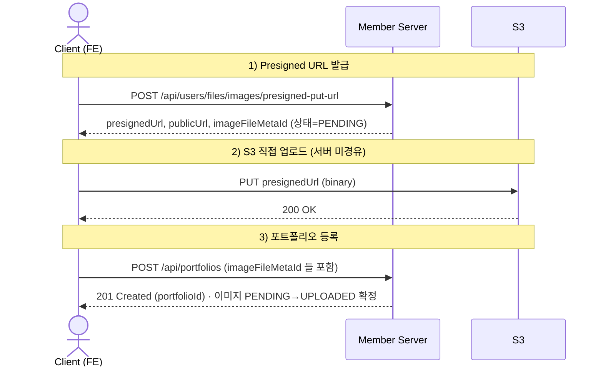
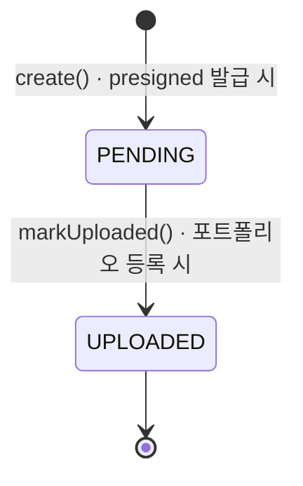

# 문서 (Docs-as-Code)

이 디렉터리는 **코드로 관리되는 다이어그램·설계 문서**를 담습니다.
그림은 코드와 똑같이 취급합니다 — repo 안에 텍스트로 두고, PR에서 리뷰하고, 관련 코드와 **같은 PR에서 함께 수정**합니다.

> **대전제: 다이어그램은 썩는다.** 틀린 그림은 없는 것보다 나쁩니다.
> 아래 규칙은 전부 "덜 썩게, 썩어도 티 나게" 관리하기 위한 장치입니다.

---

## 1. 도구: Mermaid

모든 다이어그램은 **Mermaid**로 그려 마크다운(`.md`)에 직접 넣습니다.

- GitHub이 마크다운 안의 Mermaid를 **자동으로 그림으로 렌더**합니다.
- 그래서 리뷰어는 **파일만 열면 그림이 바로 보입니다** — 다운로드·플러그인·별도 도구·CI가 필요 없습니다.
- IntelliJ / VS Code 미리보기에서도 그대로 보입니다.

> PlantUML은 표현력이 더 좋지만 GitHub이 렌더하지 못해(텍스트만 보임) 리뷰어가 그림을 보기 번거롭습니다.
> 그래서 이 repo는 "리뷰어가 바로 보는 것"을 우선해 Mermaid로 통일합니다.

---

## 2. 무엇을 그리고, 무엇을 그리지 않는가

| 종류 | 그리나? | 관리 방식 |
|---|---|---|
| 시스템 경계·핵심 플로우·상태 | ✅ | 여기서 Mermaid로 관리 |
| **API 필드 계약** | ❌ | **OpenAPI 자동생성**(`openapi3.yaml`) — 그림으로 중복 금지 |
| **DB 스키마(ERD)** | ❌ | 스키마에서 자동생성 도구 사용 |
| 클래스 다이어그램·상세 호출 그래프 | ⚠️ | 손으로 관리하지 않음(금방 썩음). 필요 시 IDE로 즉석 생성 |
| 회의용 스케치 | ❌ | Excalidraw/draw.io 등 — 버전관리 대상 아님 |

**원칙: 자동 생성할 수 있는 것은 손으로 그리지 않는다.**

---

## 3. 그리기 전에 정할 것 (고도 결정)

1. **누가 보는가?** → 상세도를 결정
   - FE 개발자 → 내부 클래스 X, "API를 어떤 순서로 부르나"만 (인터랙션 고도)
   - 신규 입사자 → 내부 계층까지 (온보딩 고도)
2. **얼마나 자주 바뀌는가?** → 고수준일수록 **일부러 추상적으로** 유지 (클래스명·필드를 박을수록 빨리 썩음)

---

## 4. 디렉터리 & 네이밍

```
docs/
├── README.md                          # 이 파일 — 인덱스 + 컨벤션 + 대표 플로우
└── diagram/                           # 다이어그램 문서 (.md, Mermaid 포함)
    ├── register-portfolio-internal.md # 포트폴리오 등록 내부 시퀀스(온보딩)
    └── portfolio-hexagonal.md         # 포트폴리오 헥사고날 구조
```

- 파일명: **kebab-case + 주제** (예: `register-portfolio-internal.md`)
- `docs/` 아래 위 화이트리스트(`README.md`, `diagram/`) 외의 파일은 **로컬 스크래치**로 git 추적되지 않습니다(`.gitignore` 참고).

---

## 5. 계약 플로우 (FE ↔ Backend)

FE 개발자가 보는 "합의된 호출 순서". 내부 어댑터는 감추고 인터랙션 고도로만 그립니다.



이미지 상태 전이:



---

## 6. 다이어그램 목록

| 문서 | 종류 | 독자 | 내용 |
|---|---|---|---|
| [register-portfolio-internal.md](diagram/register-portfolio-internal.md) | 시퀀스 | 온보딩 | 발급→업로드→등록 내부 계층 상세 |
| [portfolio-hexagonal.md](diagram/portfolio-hexagonal.md) | 컴포넌트 | 설계 리뷰 | 포트폴리오 헥사고날 계층 |

---

## 7. 협업 규칙 (썩음 방지)

1. **코드를 바꾸면 관련 다이어그램도 같은 PR에서 고친다.**
2. Mermaid는 텍스트이므로 diff·리뷰 대상이다. 리뷰어는 "코드는 바뀌었는데 그림은 안 고쳐진" 경우를 잡는다.
3. GitHub이 자동 렌더하므로 리뷰어는 PR 파일 화면에서 **그림을 바로 확인**한다. 별도 빌드·다운로드가 없다.
