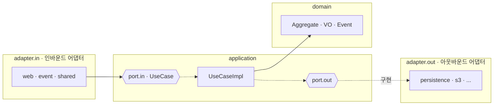
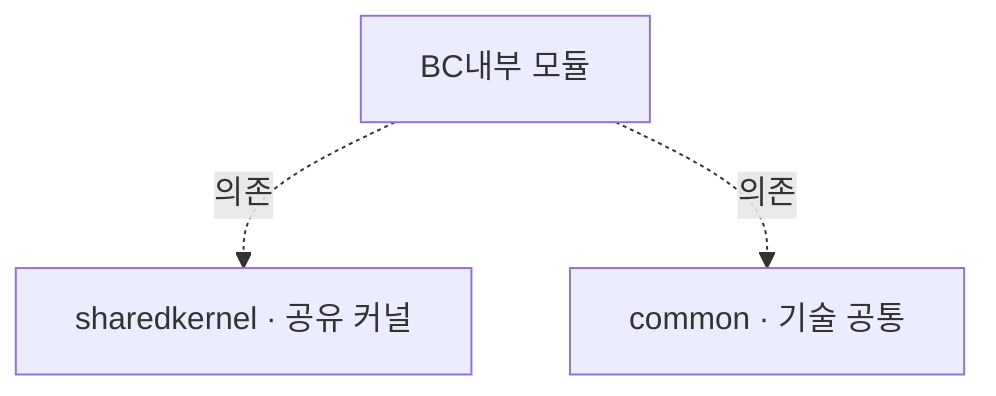

# 프로젝트 아키텍처

이 서버는 **헥사고날(포트-어댑터) 아키텍처**를 **바운디드 컨텍스트(모듈)** 단위로 적용한다.

최상위 구조:

| 패키지 | 역할 |
|---|---|
| `modules/` | 바운디드 컨텍스트(도메인 모듈)들 |
| `sharedkernel/` | 여러 BC가 공유하는 커널(공용 포트·VO·이벤트·보안 등) |
| `common/` | 기술 공통(프레임워크·유틸 등 도메인 무관) |

---

## 헥사고날 계층 (모든 모듈 공통)

각 모듈은 아래 계층을 동일하게 갖는다. **의존은 항상 바깥→안(어댑터→애플리케이션→도메인)** 으로만 흐르고, 애플리케이션은 **포트(interface)** 에만 의존한다.

| 계층 | 패키지 | 역할 |
|---|---|---|
| 인바운드 어댑터 | `adapter.in` (`web`·`event`·`shared`) | 외부 요청 수신(HTTP·이벤트·타 BC) |
| 인바운드 포트 | `application.port.in` | UseCase 인터페이스 |
| 유스케이스 | `application.usecase` | 흐름 오케스트레이션 |
| 아웃바운드 포트 | `application.port.out` | 외부 의존을 추상화한 인터페이스 |
| 도메인 | `domain` (`vo`·`event`·`exception`) | 핵심 규칙·불변식 |
| 아웃바운드 어댑터 | `adapter.out` (`persistence`·`s3`…) | 포트 구현(DB·외부 시스템) |

> `{{...}}`(육각형) = 포트(interface). 어댑터가 포트를 구현하므로, 애플리케이션은 기술 세부사항을 모른 채 동작한다.

---

## 모듈(바운디드 컨텍스트) 지도

- 각 모듈은 위 **헥사고날 계층**을 동일하게 갖는다.
- 모듈 간에는 직접 참조하지 않고 **포트로만** 연결된다(아래 의존 규칙).

---

## 의존 규칙

- **안쪽으로만 의존한다**: `adapter → application → domain`. 도메인은 바깥을 모른다.
- **애플리케이션은 포트에만 의존한다**: 구현(어댑터)이 아니라 인터페이스에 의존해 기술 교체가 자유롭다.
- **BC 간 직접 참조 금지**: 다른 모듈이 필요하면 **포트(out)** 로 요청하고, 상대 모듈의 **`adapter.in.shared`** 어댑터가 구현한다. (예: `portfolio` → `MarkImagesAsUploadedSharedPort` ← `file`)
- **공유는 `sharedkernel`, 기술 공통은 `common`** 으로 모은다.

> 특정 기능의 계층 흐름 예시는 [portfolio/register-flow.md](portfolio/register-flow.md)의 "구조 · 헥사고날 계층" 참고.
