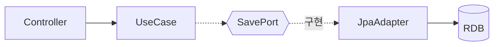
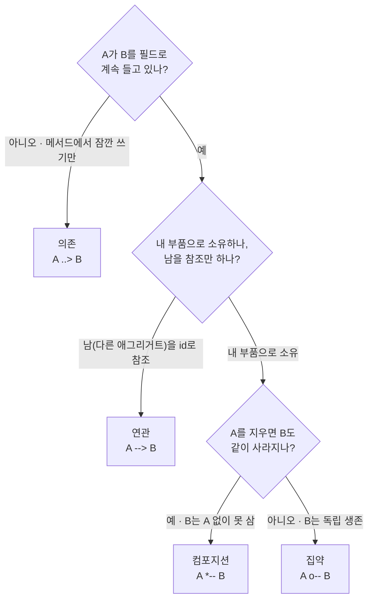
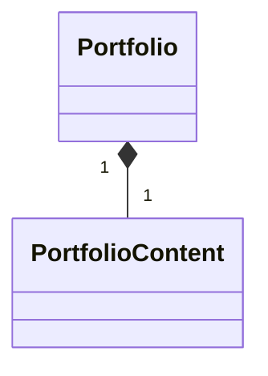
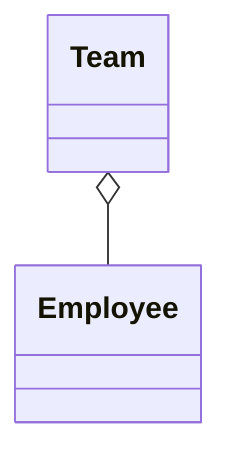
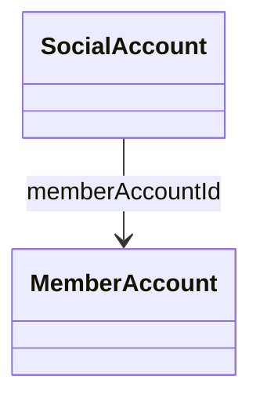
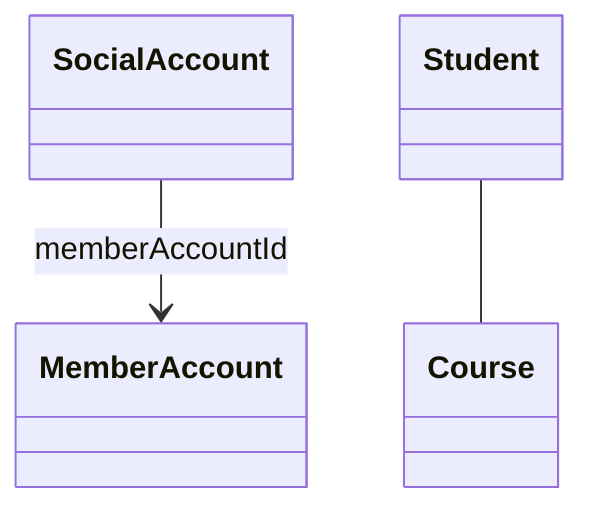
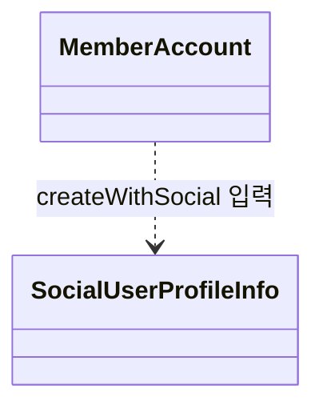
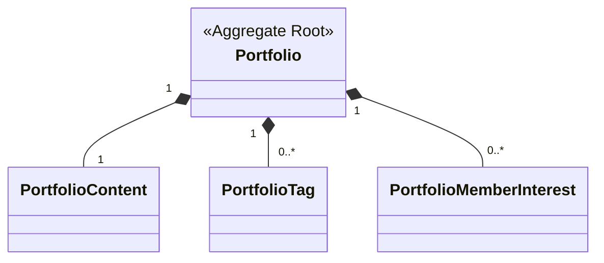
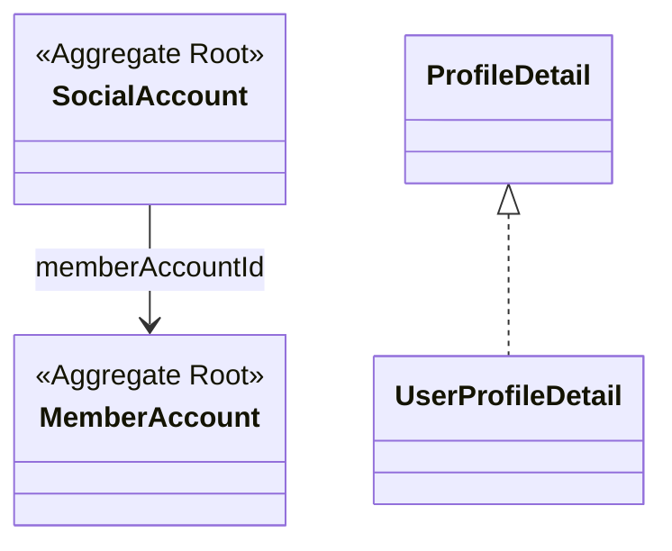

# 다이어그램 개념

도구(Mermaid 등)와 무관하게 **다이어그램 자체의 개념·용어**를 정리한다.
실제 작성 문법은 [MERMAID_CONCEPT.md](MERMAID_CONCEPT.md) 참고.

---

## 목차
1. [다이어그램을 왜 그리나](#1-다이어그램을-왜-그리나)
2. [종류와 선택 기준](#2-종류와-선택-기준)
3. [시퀀스 다이어그램](#3-시퀀스-다이어그램)
4. [상태 다이어그램](#4-상태-다이어그램)
5. [컴포넌트/구조 다이어그램](#5-컴포넌트구조-다이어그램)
6. [클래스 다이어그램 (도메인 모델)](#6-클래스-다이어그램-도메인-모델)
7. [고도(altitude) — 얼마나 자세히 그리나](#7-고도altitude--얼마나-자세히-그리나)
8. [용어 요약](#8-용어-요약)

---

## 1. 다이어그램을 왜 그리나

- 코드나 글로는 잘 안 보이는 **구조와 흐름**을 한눈에 전달한다.
- 그리기 전에 항상 **독자와 목적**을 먼저 정한다 — "누가 보나? 무엇을 이해시켜야 하나?"
- **모든 세부 구현을 담지 않는다.** 담을수록 코드 변경에 빨리 낡는다(썩는다).

> 좋은 다이어그램의 조건은 "정확함"만이 아니라 **"하나의 메시지를 명확히 전달함"** 이다.
> 한 그림에 모든 걸 넣으면 아무도 안 본다.

---

## 2. 종류와 선택 기준

이 저장소에서 쓰는 다이어그램은 네 종류다.

| 종류 | 답하는 질문 | 핵심 요소 | 이 repo 예 |
|---|---|---|---|
| **시퀀스(sequence)** | 시간에 따라 누가 누구에게 무엇을 보내나 | 참여자 · 메시지 | `register-flow` |
| **상태(state)** | 한 대상이 어떤 상태를 오가나 | 상태 · 전이 | `image-lifecycle` |
| **컴포넌트/구조(component)** | 구성요소가 어떻게 의존·연결되나 | 노드 · 의존 방향 | `ARCHITECTURE` |
| **클래스/도메인 모델(class)** | 도메인이 어떤 애그리거트·엔티티로 이루어지나 | 클래스 · 관계(UML 표준) | `domain-model` |

**무엇을 그릴지 고를 때:**
- "이 API를 부르면 뭐가 순서대로 일어나지?" → **시퀀스**
- "이 엔티티는 어떤 상태들을 거치지?" → **상태**
- "이 모듈은 무엇에 의존하지?" → **컴포넌트**
- "이 도메인은 어떤 애그리거트·엔티티로 이루어졌지?" → **클래스(도메인 모델)**

### 그 외 — 필요 시 쓸 수 있는 종류

Mermaid는 아래 종류도 지원한다. 필요해지면 도입하되, **자동 생성 가능한 것은 그리지 않는다**([7번 고도 원칙](#7-고도altitude--얼마나-자세히-그리나) 참고).

| 종류 | Mermaid | 용도 | 비고 |
|---|---|---|---|
| 플로우차트 | `flowchart` | 처리 흐름·분기 | 컴포넌트/구조도에도 사용 |
| ER 다이어그램 | `erDiagram` | 테이블 관계 | DB 스키마는 **자동생성** 권장 |
| C4 | `C4Context` | 시스템·컨테이너 수준 아키텍처 | 아키텍처 확장 시 |
| 간트 | `gantt` | 일정 | 프로젝트 관리 |
| 사용자 여정 | `journey` | UX 단계별 경험 | 기획 협업 |

---

## 3. 시퀀스 다이어그램

**시간에 따른 상호작용의 순서**를 그린다. 시간은 **위에서 아래로** 흐른다.

### 3.1 한눈에 보는 구조 (anatomy)

```
 Client        Server         DB          ← 참여자 (맨 위 박스)
   │             │             │
   │   request   │             │           ← 생명선(lifeline): 세로선
   ├────────────▶█             │
   │             █   query     │           █ = 활성화 막대(처리 중인 구간)
   │             ├────────────▶█
   │             █◀╌╌╌╌╌╌╌╌╌╌╌─┤           ╌╌ 점선 = 응답/반환
   ◀╌╌╌╌╌╌╌╌╌╌╌─┤             │
   │             │             │
   ▼ (아래로 갈수록 나중에 일어남)
```

### 3.2 참여자(Participant)와 생명선(Lifeline)

- **참여자**: 상호작용의 주체(사용자·서버·DB…). 상단에 박스/사람 모양으로 놓인다.
  - **액터(actor)**: 사람(스틱맨) 모양. 보통 외부 사용자/클라이언트.
  - **참여자(participant)**: 사각형 박스. 보통 시스템 내부 구성요소.
- **생명선(Lifeline)**: 참여자 아래로 뻗는 **세로선**. 시간축에서 그 참여자가 존재함을 나타낸다.

### 3.3 활성화 막대(Activation bar)

생명선 위에 겹치는 **얇은 세로 막대**. 그 참여자가 **일을 처리 중인 구간**(호출을 받아 응답을 돌려주기 전까지)을 나타낸다. 활성화가 중첩되면 그만큼 막대가 겹쳐 그려진다.

### 3.4 메시지 — 선과 화살촉의 의미

"도형·선"의 핵심. **선 모양**(실선/점선)과 **화살촉 모양**이 각각 의미를 가진다.

| 개념 | 선 | 화살촉 | 도형 | 뜻 |
|---|---|---|---|---|
| **동기 호출** | 실선 | 채운 삼각 | `───▶` | 요청하고 **응답을 기다림** |
| **응답/반환** | 점선 | 채운 삼각 | `╌╌▶` | 호출에 대한 되돌림 |
| **비동기 메시지** | 실선 | 열린 삼각 | `───▷` | 보내고 **기다리지 않음** |
| **자기 호출(self)** | 자기 자신으로 | — | `↺` | 내부 계산·자기 위임 |
| **유실(lost)** | 실선 | 끝에 X | `───✕` | 도달 못 함/실패/소멸 |

> 관례: **요청은 실선, 응답은 점선**으로 그려 둘을 구분한다.

### 3.5 노트(Note)

참여자 옆/위에 붙이는 **설명 상자**. 흐름(메시지)에 담기지 않는 부연(제약, 이벤트, 상태 등)을 적는다.

### 3.6 결합 프래그먼트(Combined fragment)

`if`·반복 같은 **제어 구조를 박스로 묶어** 표현하는 틀.
박스 왼쪽 위 **라벨**이 종류를, `[조건]`(**가드**)이 실행 조건을 나타낸다.

| 라벨 | 뜻 | 의미 | 코드 비유 |
|---|---|---|---|
| `alt` | alternative | 여러 경우 중 하나 실행 | `if / else` |
| `opt` | optional | 조건 참일 때만 실행 | `if`(else 없음) |
| `loop` | loop | 반복 실행 | `for / while` |
| `par` | parallel | 병렬 실행 | 동시 처리 |
| `break` | break | 조건 시 이후 흐름 중단 | 예외 후 탈출 |
| `critical` | critical region | 중간에 끊기면 안 되는 필수 구간 | 원자적 처리 |

> 예: "용량 초과면 400, 아니면 발급 진행" → `alt` 박스로 두 갈래를 묶어 **둘 중 하나만** 일어남을 표현.

### 3.7 흔한 실수

- 모든 클래스·필드를 다 넣는다 → 리팩터링 한 번에 낡는다.
- 요청과 응답을 같은 선으로 그린다 → 실선/점선으로 구분하자.
- 한 그림에 성공·실패 시나리오를 뒤섞는다 → 프래그먼트로 분리하자.

---

## 4. 상태 다이어그램

한 대상의 **상태(state)** 와 **전이(transition)** 를 그린다. "이 엔티티가 살아있는 동안 어떤 상태를 거치나".

| 요소 | 뜻 |
|---|---|
| **상태(state)** | 대상이 머무는 조건 (예: `PENDING`, `UPLOADED`) |
| **전이(transition)** | 상태를 바꾸는 화살표. `트리거[가드]` 로 조건을 붙일 수 있다 |
| **시작/종료** | 진입점(시작 지점)과 종료점 |
| **복합 상태(composite)** | 상태 안에 하위 상태들을 품는 것 |

**언제 쓰나**: 엔티티 라이프사이클, 주문/결제 상태, 워크플로우 등.
예: 이미지 메타 `PENDING → UPLOADED`.

---

## 5. 컴포넌트/구조 다이어그램

구성요소와 그들 사이의 **의존 방향**을 그린다. "무엇이 무엇에 의존하나".

| 요소 | 도형/기호 | 뜻 |
|---|---|---|
| **노드** | `[사각형]` | 구성요소(컨트롤러·유스케이스·어댑터·DB…) |
| **포트** | `{{육각형}}` | 인터페이스 경계. 애플리케이션이 의존하는 지점 |
| **의존/호출** | 실선 화살 `───▶` | 의존/호출 **방향** (이 그림의 핵심 메시지) |
| **구현** | 점선 화살 `╌╌▶` | 포트 ← 어댑터가 구현 |
| **그룹** | `subgraph` 박스 | 계층·모듈 경계 |

**예시** — 헥사고날 계층(포트=육각형, 구현=점선):



> Controller가 UseCase를 호출(실선)하고, UseCase는 **포트(육각형)에만** 의존한다. 그 포트를 `JpaAdapter`가 **구현**(점선 `구현`)하며 DB에 접근한다 — "애플리케이션은 기술을 모른 채 포트에만 의존"함을 나타낸다.

**언제 쓰나**: 아키텍처 개요, 의존성 방향, 헥사고날 계층, 모듈 경계.
예: 포트폴리오 헥사고날 `adapter.in → application(port) → domain` — [portfolio/register-flow.md](portfolio/register-flow.md).

---

## 6. 클래스 다이어그램 (도메인 모델)
> 참고하기 좋은 자료: https://sabarada.tistory.com/72

도메인이 **어떤 애그리거트·엔티티로 이루어지고 어떻게 연결되나**를 그린다. **UML 표준 클래스 다이어그램** 표기를 그대로 쓴다 — 표준이라 읽는 사람이 이미 알고 있어 **별도 범례가 필요 없다**. (Mermaid 문법은 [MERMAID_CONCEPT.md](MERMAID_CONCEPT.md) 6장.)

### 6.1 클래스 · 스테레오타입

- **클래스** = 도메인 타입(애그리거트 루트 · 엔티티 · 인터페이스 · VO).
- **스테레오타입 `<<...>>`** = 타입 분류 표시. 클래스 본문 첫 줄에 붙인다. 이 repo에서 쓰는 것:
  - `<<Aggregate Root>>` — 애그리거트 루트
  - `<<interface>>` — 인터페이스(sealed 포함)
  - `<<abstract>>` — 추상 클래스
  - `<<enumeration>>` — 열거형(enum)

### 6.2 관계 — 선과 끝 기호의 의미

끝 기호가 **세 계열**로 나뉜다 — **마름모**(소유), **삼각**(상속/구현), **화살**(참조). 선은 실선/점선으로 강·약을 구분한다.

| 관계 | Mermaid | 도형 | 뜻 |
|---|---|---|---|
| **컴포지션** | `A *-- B` | `A ◆──── B` | A가 B를 **소유**(생명주기 함께). 애그리거트 루트 → 자식 |
| **집약** | `A o-- B` | `A ◇──── B` | A가 B를 참조(생명주기 독립) |
| **연관** | `A --> B` | `A ────→ B` | A가 B를 안다/참조 (다른 애그리거트 **id 참조**) |
| **의존** | `A ..> B` | `A ╌╌╌→ B` | A가 B를 일시적으로 사용 |
| **일반화(상속)** | `A <\|-- B` | `A ◁──── B` | **B가 A를 상속** (A가 부모) |
| **실체화** | `A <\|.. B` | `A ◁╌╌╌ B` | **B가 A(인터페이스)를 구현** |

**기호 읽는 법** (기호가 붙는 쪽이 핵심)

- **마름모** = 소유. `◆`(채운)=컴포지션(강함), `◇`(빈)=집약(느슨). **소유하는 A 쪽**에 붙는다.
- **빈 삼각 `◁`** = 상속·구현. **부모·인터페이스인 A 쪽**에 붙는다. (실선=상속, 점선=구현)
- **화살 `→`** = 참조. **가리키는 B 쪽**에 붙는다. (실선=연관, 점선=의존)
- **다중도**는 관계 양 끝에 `"1"` · `"0..*"` · `"1..*"` 로 붙인다.

### 6.3 컴포지션 · 집약 · 연관 · 의존 구분

이 넷이 가장 헷갈린다. **"A와 B가 얼마나 강하게 엮였나"** 하나의 스펙트럼으로 보면 쉽다. 강→약 순서다.

```
강함 ◀──────────────────────────────────────────▶ 약함
  컴포지션 ◆       집약 ◇        연관 →         의존 ╌→
 소유+생명주기     소유+독립      id로 참조       잠깐 사용
```

**판별 순서** — 위에서부터 예/아니오로 내려가면 하나로 정해진다.



**하나씩 — 도형과 우리 코드에서의 예**

① **컴포지션 `*--`** — 채운 마름모 ◆. 소유 + **생명주기 공유**.



> 생명주기 테스트: *`Portfolio`를 지우면?* → `PortfolioContent`(본문)도 함께 삭제된다. 본문은 포트폴리오 없이 존재할 수 없다. 마름모는 소유자(Portfolio) 쪽에 붙는다. **우리 애그리거트 루트↔자식은 전부 이것.**

② **집약 `o--`** — 빈 마름모 ◇. 소유하지만 **생명주기 독립**.



> 생명주기 테스트: *팀을 해체하면?* → 직원은 회사에 그대로 남는다. 부분이 독립적으로 산다. 컴포지션과 겉모습(마름모)은 같고 **채움/빔**만 다르다. *우리 도메인엔 거의 없다.*

③ **연관 `-->`** — 열린 화살 →. 소유 아님, **다른 애그리거트를 id로 참조**.



> `SocialAccount`는 `MemberAccount`를 자바 객체가 아니라 `memberAccountId`(id 값)로만 안다. 애그리거트 경계를 넘을 땐 객체로 물지 않는 게 DDD 원칙이다. 소유가 아니라, 서로 지워도 참조만 끊긴다.

연관은 다시 두 축으로 나뉜다.

*방향 — 누가 누구를 아는가*

- **단방향**: 한쪽만 상대를 안다. **화살촉 있는 실선** `A --> B`.
- **양방향**: 서로가 서로를 안다. **화살촉 없는 실선** `A -- B`. 양쪽 다 navigable이면 화살표를 양끝에 다는 대신 **아예 생략**하는 게 UML 관례다.



> `-->`(위): `SocialAccount`만 `MemberAccount`를 안다 → **단방향**. `--`(아래): `Student`↔`Course`가 서로 안다 → **양방향**이라 화살촉이 없다.

*참조 방식 — 무엇으로 아는가 (객체 연관 vs 식별자 연관)*

| 방식 | 필드 형태 | 언제 | 표기 |
|---|---|---|---|
| **객체 연관** | 상대 **객체** (`Member member`) | 같은 애그리거트 내부 | 보통 컴포지션 `*--` 으로 표현 |
| **식별자 연관** | 상대 **id** (`Long memberId`) | **애그리거트 경계를 넘을 때**(DDD 원칙) | `A --> B : memberId` — 화살에 **id 필드명** 라벨 |

- 애그리거트끼리는 객체로 직접 물지 않고 **id로만** 참조한다(DDD). 그래서 이 repo의 경계 넘는 연관은 전부 **식별자 연관**이고, 화살표 라벨에 그 id 필드명을 적는다.
- 도형(열린 화살)은 객체·식별자가 똑같다. **라벨(id 필드명)의 유무가 "id로 참조"라는 신호**다 — 예: `SocialAccount --> MemberAccount : memberAccountId`.

④ **의존 `..>`** — 점선 화살 ╌→. 필드로도 안 들고 **잠깐 쓰기만**. 가장 약함.



> `MemberAccount`는 소셜 가입 시 `SocialUserProfileInfo`를 **팩토리 파라미터로만** 받아 동의 검증·이벤트 발행에 쓰고 **필드로 저장하지 않는다**(필드는 email·role 등뿐). 생성이 끝나면 관계가 사라지므로 가장 약한 의존이다.

**실무 팁**

- **컴포지션 vs 집약**이 애매하면 → *"부모를 지울 때 자식도 지우나?"* 하나로 결정한다. 지우면 컴포지션, 아니면 집약.
- **연관 vs 의존**이 애매하면 → *"필드로 계속 들고 있나?"* 로 결정한다. 들고 있으면 연관, 파라미터·반환·지역에서 잠깐이면 의존.
- 우리 프로젝트는 실질적으로 **컴포지션**(루트↔자식) · **연관**(경계 넘는 id 참조) · **의존**(조회로만 엮임) 3개만 나온다. 집약은 UML 표준이라 적어둘 뿐 거의 안 쓴다.

### 6.4 예시

**애그리거트 = 루트 + 자식(컴포지션) + 다중도** (portfolio):



> `Portfolio`(애그리거트 루트)가 본문 1개·태그 0..\*개·관심 0..\*개를 **소유(컴포지션)** 함을 나타낸다. 채운 마름모가 Portfolio 쪽에 붙어 "루트가 자식의 생명주기를 관리"한다는 뜻이고, `"1"`·`"0..*"`는 다중도(개수)다.

**애그리거트 간 id 참조(연관) + 다형(실체화)** (account · profile):



> 두 가지를 보여준다.
> - **연관(열린 화살)** — `SocialAccount --> MemberAccount`: 다른 애그리거트를 객체가 아닌 `memberAccountId`(id)로만 참조한다(DDD 원칙).
> - **실체화(점선 삼각)** — `ProfileDetail <|.. UserProfileDetail`: `UserProfileDetail`이 sealed 타입 `ProfileDetail`을 구현한다.

### 6.5 언제 쓰나 · 주의

- **언제 쓰나**: 도메인 모델 개요, 애그리거트 경계와 엔티티 구성·관계. 예: `portfolio/domain-model.md`.
- **필드는 그리지 않는다.** 필드명은 자주 바뀌어 낡으므로(자동 생성·즉석의 영역), 클래스 본문엔 스테레오타입만 두고 **필드·VO·불변식은 표로** 둔다. → 표준 표기이면서 안 낡는 그림.

---

## 7. 고도(altitude) — 얼마나 자세히 그리나

같은 흐름도 **독자에 따라 상세도**를 달리한다. **한 다이어그램엔 한 고도만** 담는다.

| 고도 | 독자 | 담는 것 | 감추는 것 |
|---|---|---|---|
| **계약(인터랙션) 고도** | 클라이언트/FE | 외부에서 본 호출 순서 | 내부 계층·클래스 |
| **내부 고도** | 백엔드 개발자 | 계층·유스케이스·어댑터 흐름 | 사소한 유틸 호출 |

> 고도를 섞으면(외부 계약 + 내부 클래스 한 그림) 읽기 어렵고 빨리 낡는다.

---

## 8. 용어 요약

| 용어 | 한 줄 정의 |
|---|---|
| 참여자(Participant) | 상호작용의 주체 |
| 생명선(Lifeline) | 참여자의 시간축 세로선 |
| 활성화(Activation) | 처리 중인 구간을 나타내는 막대 |
| 메시지(Message) | 참여자 간 화살표(호출/응답) |
| 가드(Guard) | 프래그먼트/전이의 실행 조건 `[조건]` |
| 결합 프래그먼트 | 제어 구조를 묶는 박스(alt/opt/loop…) |
| 상태(State) | 대상이 머무는 조건 |
| 전이(Transition) | 상태를 바꾸는 사건 |
| 포트(Port) | 인터페이스 경계(헥사고날) |
| 컴포지션(Composition) | 전체가 부분을 소유(생명주기 함께)하는 관계 |
| 연관(Association) | 한 타입이 다른 타입을 참조 |
| 다중도(Multiplicity) | 관계 양 끝의 개수 (`1`·`0..*`) |
| 스테레오타입(Stereotype) | `<<...>>` 분류 표시 |
