# Mermaid 문법

[다이어그램 개념](DIAGRAM_CONCEPT.md)을 **Mermaid 문법으로 어떻게 쓰는지** 정리한다.
각 예제는 그대로 복사하면 GitHub·IDE에서 렌더된다.

---

## 목차
1. [Mermaid란](#1-mermaid란)
2. [기본 구조와 공통 규칙](#2-기본-구조와-공통-규칙)
3. [시퀀스 다이어그램](#3-시퀀스-다이어그램)
4. [상태 다이어그램](#4-상태-다이어그램)
5. [플로우차트 (컴포넌트/구조)](#5-플로우차트-컴포넌트구조)
6. [클래스 다이어그램 (도메인 모델)](#6-클래스-다이어그램-도메인-모델)
7. [렌더·검증](#7-렌더검증)

---

## 1. Mermaid란

- **텍스트로 다이어그램을 그리는 문법.** 마크다운의 ` ```mermaid ` 코드펜스 안에 작성한다.
- GitHub·IntelliJ·VS Code가 자동으로 렌더 → **파일만 열면 그림이 보인다**(별도 도구 불필요).

````markdown
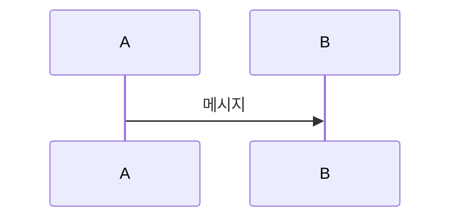
````

---

## 2. 기본 구조와 공통 규칙

- **첫 줄에 다이어그램 종류를 선언**한다: `sequenceDiagram`, `stateDiagram-v2`, `flowchart LR` 등.
- **주석**은 `%%` 로 시작한다.
- **줄바꿈**은 라벨 안에서 `<br>` 를 쓴다.
- 라벨에 특수문자(`()`, `:` 등)가 많으면 `"큰따옴표"` 로 감싼다.

---

## 3. 시퀀스 다이어그램

`sequenceDiagram` 으로 시작한다. 시간은 위에서 아래로 흐른다.

### 3.1 참여자 선언

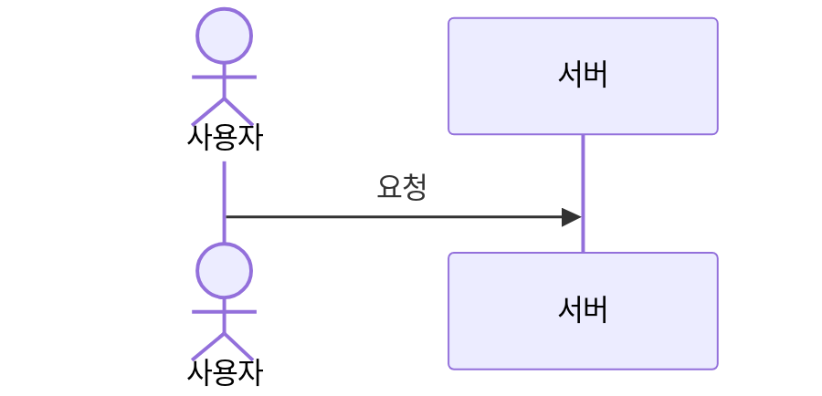

- `actor` = 사람 모양, `participant` = 박스
- `as` 로 별칭(표시 이름)을 준다.
- `box … end` 로 여러 참여자를 묶는다:

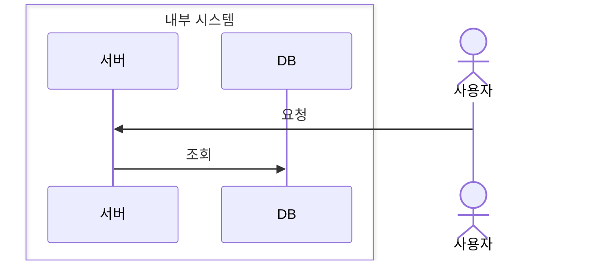

### 3.2 화살표(메시지)

| 문법 | 선 | 화살촉 | 도형 | 의미 |
|---|---|---|---|---|
| `->>` | 실선 | 채운 삼각 | `───▶` | 동기 호출(요청) |
| `-->>` | 점선 | 채운 삼각 | `╌╌▶` | 응답/반환 |
| `-)` | 실선 | 열린 삼각 | `───▷` | 비동기 |
| `-x` | 실선 | 끝에 X | `───✕` | 유실/실패 |
| `->` | 실선 | 없음 | `───` | 화살촉 없는 실선 |
| `-->` | 점선 | 없음 | `╌╌╌` | 화살촉 없는 점선 |

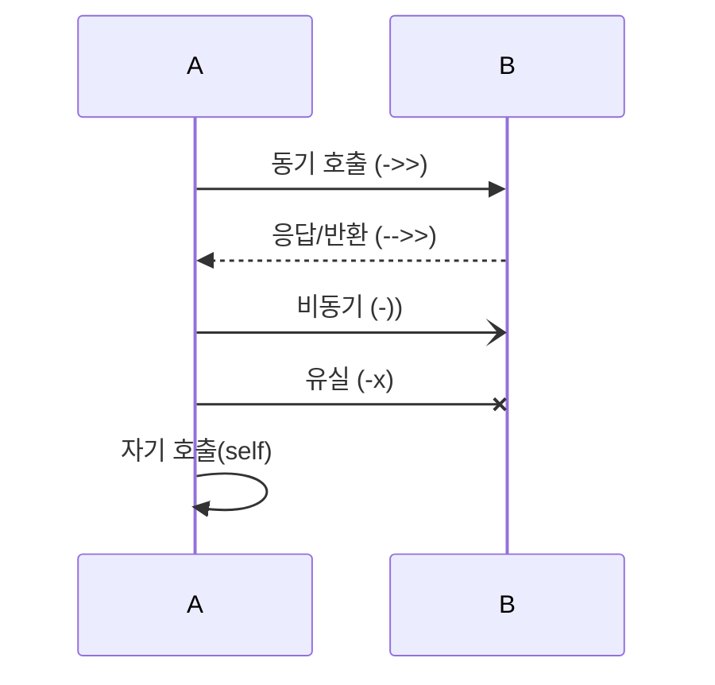

### 3.3 활성화 막대

`+`(시작)/`-`(종료) 를 화살표 뒤에 붙이거나, `activate`/`deactivate` 를 직접 쓴다.

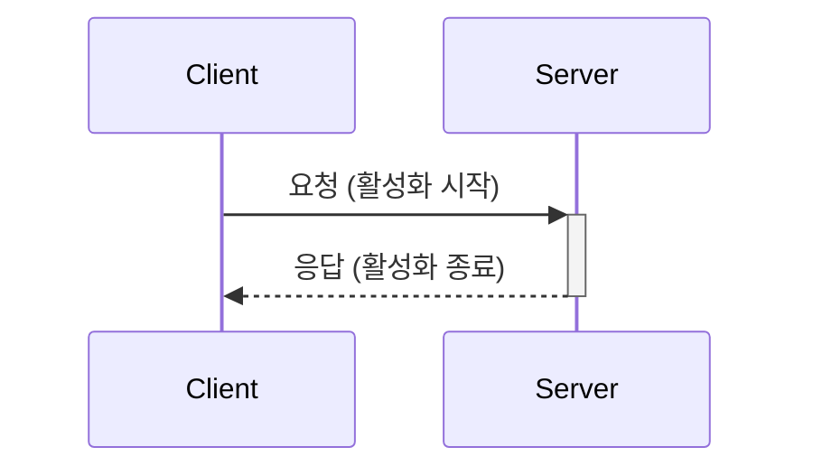

### 3.4 참여자 생성·소멸

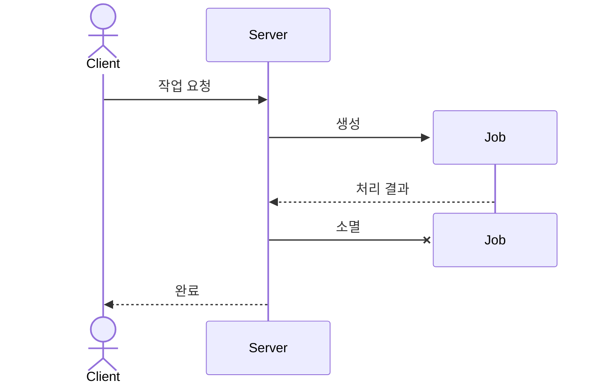

### 3.5 노트

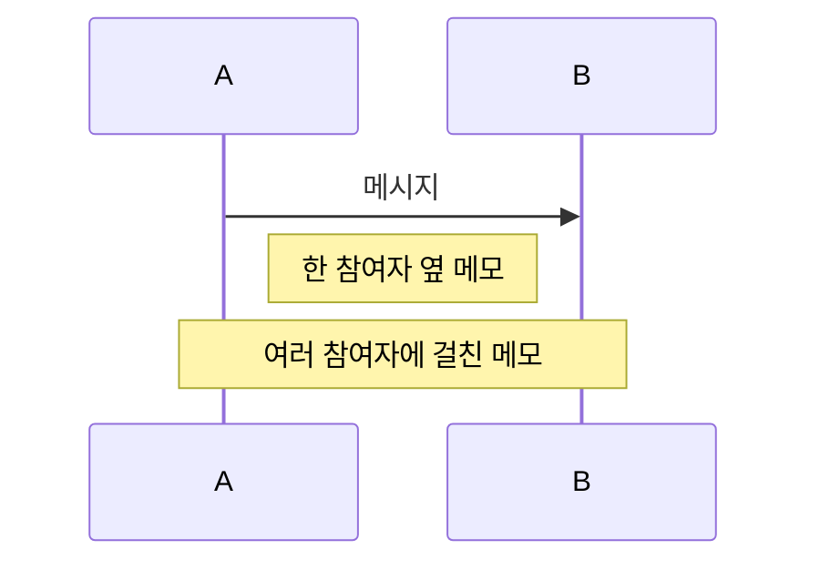

### 3.6 결합 프래그먼트

`alt`·`opt`·`loop`·`par`·`break`·`critical` 로 열고 `end` 로 닫는다.
`alt`는 `else`, `critical`은 `option`, `par`는 `and` 로 분기한다.

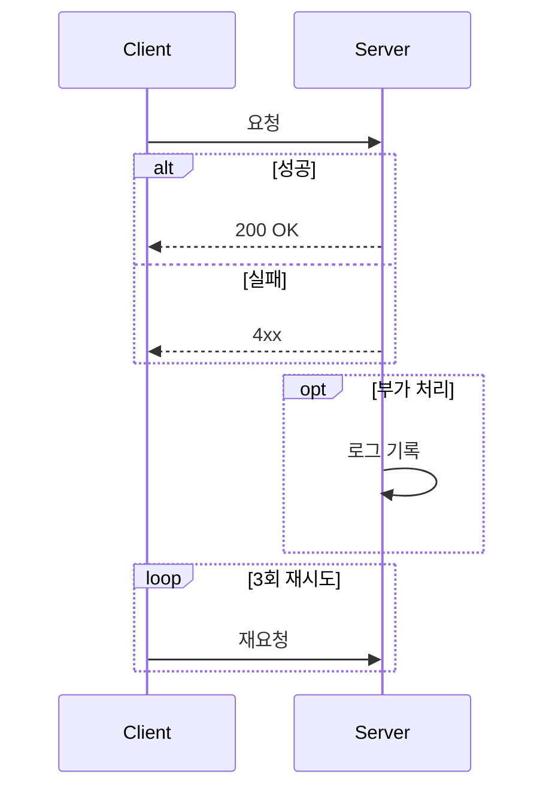

> UML의 `ref`(다른 다이어그램 참조)는 Mermaid가 지원하지 않는다. 해당 문서로의 링크로 대체한다.

### 3.7 자동 번호 · 구간 강조

`autonumber` 는 메시지에 번호를 매긴다. `rect rgb(...)` 는 구간에 배경색을 준다.

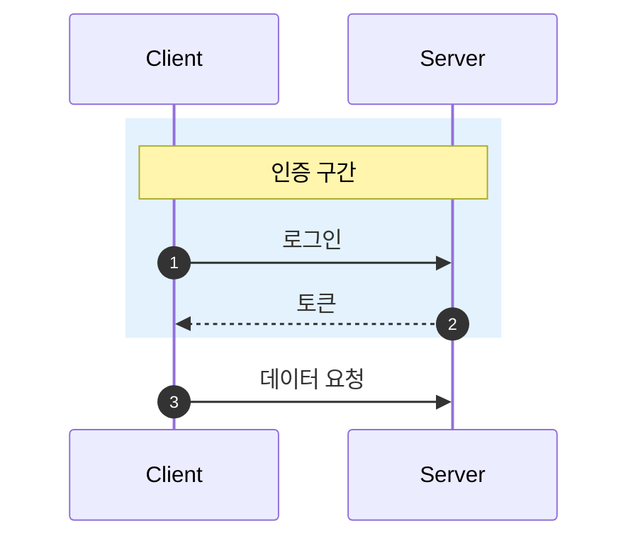

---

## 4. 상태 다이어그램

`stateDiagram-v2` 로 시작한다.

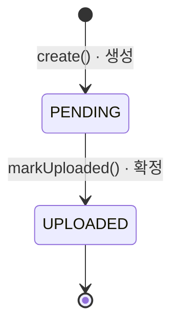

- `[*]` = 시작/종료 지점
- `상태 --> 상태: 계기` 로 전이를 쓴다

**복합 상태(하위 상태 품기)** 와 **선택(choice)**:

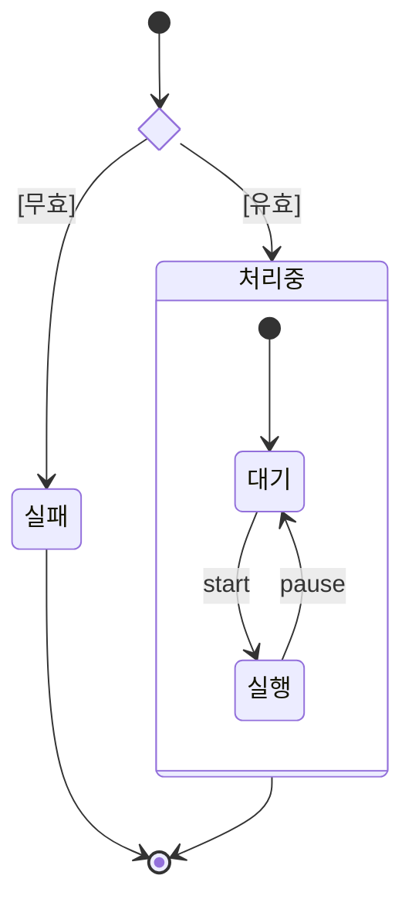

---

## 5. 플로우차트 (컴포넌트/구조)

`flowchart LR`(좌→우) 또는 `flowchart TB`(위→아래) 로 시작한다.

### 5.1 노드 모양

| 문법 | 모양 | 용도 |
|---|---|---|
| `[텍스트]` | 사각형 | 일반 노드 (각진 모서리) |
| `(텍스트)` | 둥근 사각형 | 일반 노드 (둥근 모서리) — 용도는 같고 모양만 다름 |
| `([텍스트])` | 스타디움 | 시작/끝·액터 |
| `[[텍스트]]` | 서브루틴 | 하위 처리 |
| `[(텍스트)]` | 원통 | DB/저장소 |
| `((텍스트))` | 원 | 연결점 |
| `{텍스트}` | 마름모 | 판단/분기 |
| `{{텍스트}}` | 육각형 | 포트/인터페이스 |
| `[/텍스트/]` | 평행사변형 | 입출력 |

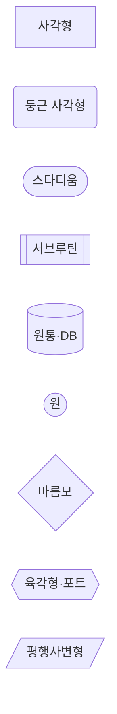

### 5.2 화살표(엣지)

| 문법 | 선 | 화살촉 | 도형 | 의미 |
|---|---|---|---|---|
| `-->` | 실선 | 채운 삼각 | `───▶` | 실선 화살표 |
| `---` | 실선 | 없음 | `───` | 실선(화살촉 없음) |
| `-.->` | 점선 | 채운 삼각 | `╌╌▶` | 점선 화살표 |
| `==>` | 굵은 실선 | 채운 삼각 | `═══▶` | 강조 화살표 |

- `-->|라벨|` 로 화살표에 설명을 붙인다.

### 5.3 그룹(subgraph)

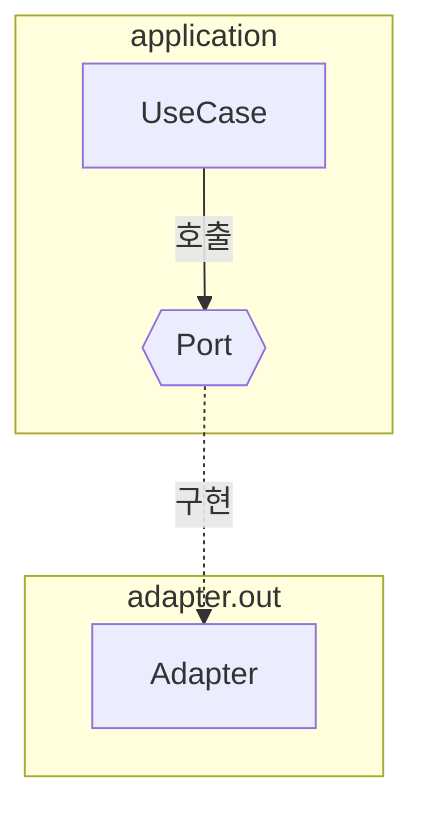

---

## 6. 클래스 다이어그램

`classDiagram` 으로 시작한다. 클래스와 그 사이의 **UML 표준 관계**를 그린다. 표기가 UML 표준이라 별도 범례가 필요 없다.

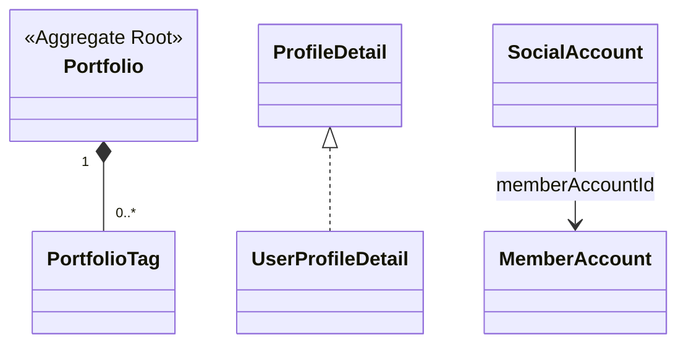

### 6.1 클래스 · 스테레오타입

- `class Name { }` 로 선언한다.
- 본문에 `<<...>>` 로 **스테레오타입**을 붙인다: `<<Aggregate Root>>`, `<<interface>>`, `<<abstract>>`, `<<enumeration>>` …

### 6.2 관계 (UML 표준)

정해진 **화살촉/선**이 의미를 갖는다. **마름모·삼각**은 소유·부모 쪽 끝에, **화살**은 가리키는 대상 쪽에 붙는다.

- `A <|-- B` — **일반화(상속)**: B 가 A 를 상속
- `A <|.. B` — **실체화**: B 가 인터페이스 A 를 구현
- `A *-- B` — **컴포지션**(채운 마름모): A 가 B 를 소유(생명주기 함께)
- `A o-- B` — **집약**(빈 마름모): A 가 B 를 참조(생명주기 독립)
- `A --> B` — **연관(단방향)**: A 가 B 를 안다/참조
- `A -- B` — **연관(양방향)**: 서로 참조 → 화살촉 없는 실선
- `A ..> B` — **의존**: A 가 B 를 일시적으로 사용

관계에 이름을 붙이려면 `: 라벨` — 예: `SocialAccount --> MemberAccount : memberAccountId`.

### 6.3 다중도(multiplicity)

관계 양 끝에 `"..."` 로 표기한다: `"1"`, `"0..*"`, `"1..*"`.

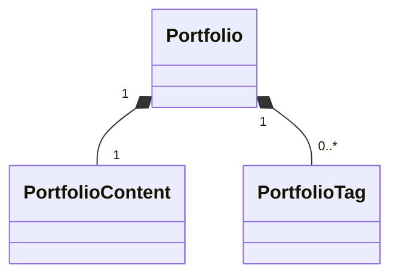

> **도메인 모델 작성 시**: 필드는 클래스 본문에 넣지 않는다(자주 바뀌어 낡음). 스테레오타입·관계·다중도만 그리고, 필드·불변식은 표로 둔다.

---

## 7. 렌더·검증

- **GitHub/IDE**: 파일을 열면 자동 렌더된다.
- **로컬 검증**(선택): 코드펜스 안 내용을 `.mmd` 로 저장 후
  `npx -p @mermaid-js/mermaid-cli mmdc -i diagram.mmd -o out.svg`
