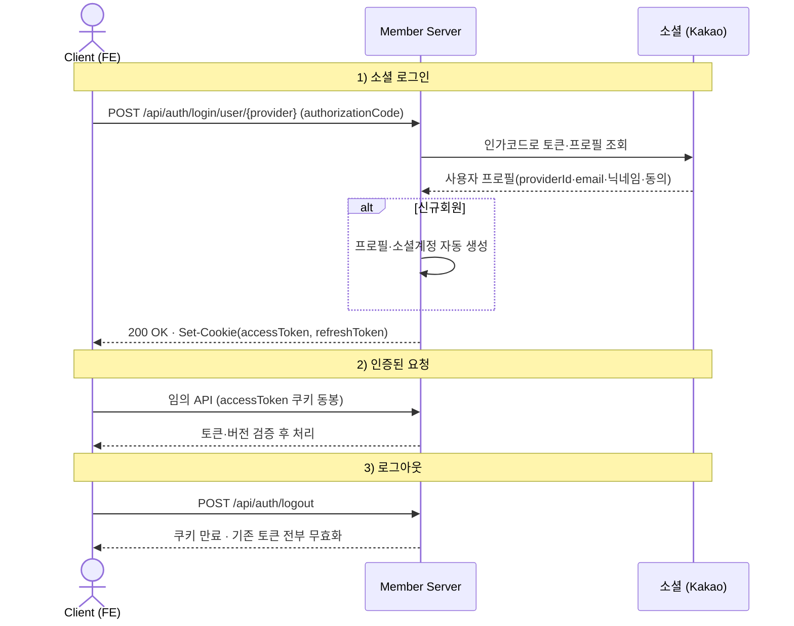
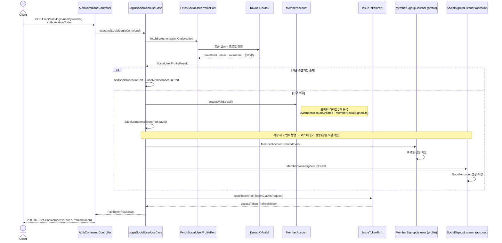
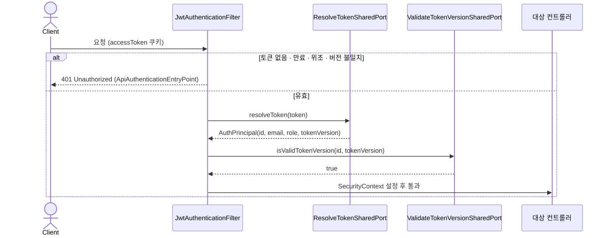
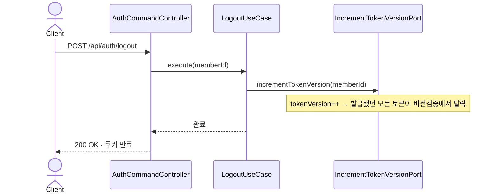
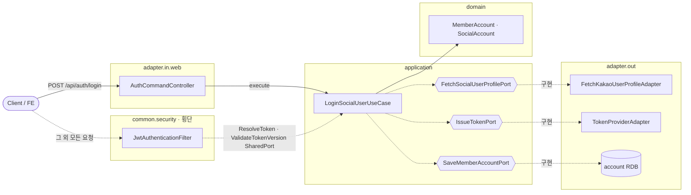

# 소셜 로그인·인증 흐름

`account` 모듈의 **OAuth2 소셜 로그인**과, 이후 모든 요청에 걸리는 **JWT 인증**을 다룬다.
토큰(accessToken·refreshToken)은 **쿠키**로 오간다. 계층 일반론은 [../ARCHITECTURE.md](../ARCHITECTURE.md) 참고.

## 계약 플로우 (Client ↔ Backend)

> 클라이언트 관점의 호출 순서. 내부 어댑터는 감춘 인터랙션 고도.

---

## 내부 처리 · 소셜 로그인

> 신규/기존 회원 분기와 도메인 이벤트로 인한 부수 생성(프로필·소셜계정)을 담은 백엔드 고도.

> 로그인 처리는 `TransactionTemplate` 로 감싼 한 트랜잭션이다. `save` 시 `@DomainEvents` 로 이벤트가 발행되고, `@EventListener` 리스너가 **같은 트랜잭션 안에서 동기로** 프로필(`profile`)·소셜계정(`account`)을 만든다.

---

## 요청 인증 (매 요청 · 횡단)

> `account` 가 제공하는 공용 포트를 `common` 의 필터가 모든 요청에서 사용한다.

## 로그아웃 · 토큰 무효화

---

## 실패 분기

| 상황 | 응답 |
|---|---|
| 카카오 API 실패 | 카카오 응답 상태 전파(4xx/5xx) |
| 이메일/닉네임 동의 누락 | 400 (`SocialAccountDomainException`) |
| 토큰 없음·만료·위조·버전 불일치 | 401 (`ApiAuthenticationEntryPoint`) |
| 기존 회원 조회 정합성 오류 | 500 (`DataConsistencyException`) |

## 도메인 이벤트

| 이벤트 | 발행 | 구독(리스너) | 결과 |
|---|---|---|---|
| `MemberAccountCreatedEvent` | `MemberAccount.createWithSocial()` | profile · `MemberSignupListener` (동기) | 프로필 자동 생성 |
| `MemberSocialSignedUpEvent` | 〃 | account · `SocialSignupListener` (동기) | `SocialAccount` 저장 |

---

## 구조 · 헥사고날 계층

- `{{...}}`(육각형) = 포트(interface). 어댑터가 구현한다.
- 인증 필터는 특정 API가 아니라 **모든 요청**에 걸리는 횡단 관심사다.
