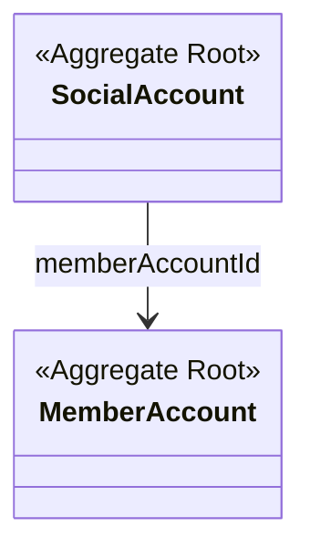

# account 도메인 모델

인증·회원 계정을 담당한다. 두 애그리거트(`MemberAccount`·`SocialAccount`)는 부모-자식이 아니라 **독립 루트**이며, `SocialAccount` 가 `memberAccountId` 로 회원을 가리킨다.
로그인·인증 흐름은 [auth-flow.md](auth-flow.md) 참고.

## 구성 (클래스 다이어그램)

## 애그리거트 · 불변식

| 애그리거트 | 역할 | 불변식 |
|---|---|---|
| `MemberAccount` | 회원 계정(이메일·역할·토큰버전) | `createWithSocial()` 로만 신규 생성. 생성 시 프로필·소셜계정 이벤트 등록 |
| `SocialAccount` | 소셜 로그인 연동 정보 | `(memberAccountId, provider, providerId)` 유일. `create()` 로 생성 |

## 값 객체 · 상태

| VO / enum | 값 · 의미 |
|---|---|
| `MemberRole` | `ADMIN` · `USER` · `CORPORATOR` |
| `SocialUserProfileInfo` | 소셜 프로필(provider·providerId·email·동의). `ensureConsentedForLink()` — 이메일·닉네임 동의 **둘 다 필수** |
| `OAuth2Provider` (공유) | `KAKAO` |

## 도메인 이벤트

| 이벤트 | 발행 | 구독 |
|---|---|---|
| `MemberAccountCreatedEvent` | `createWithSocial()` | profile · 프로필 자동 생성 |
| `MemberSocialSignedUpEvent` | `createWithSocial()` | account · `SocialAccount` 저장 |
