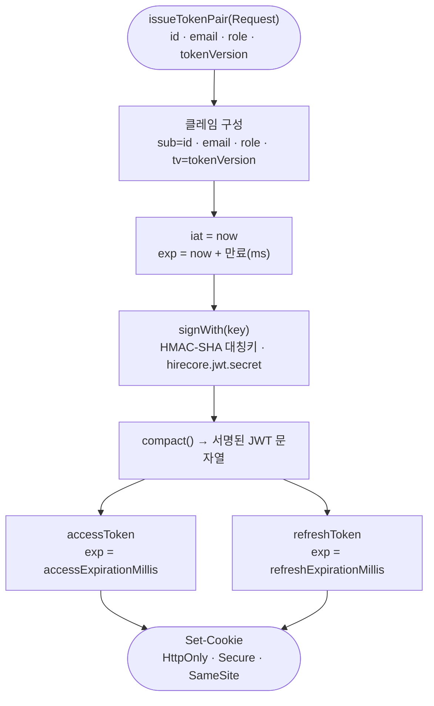
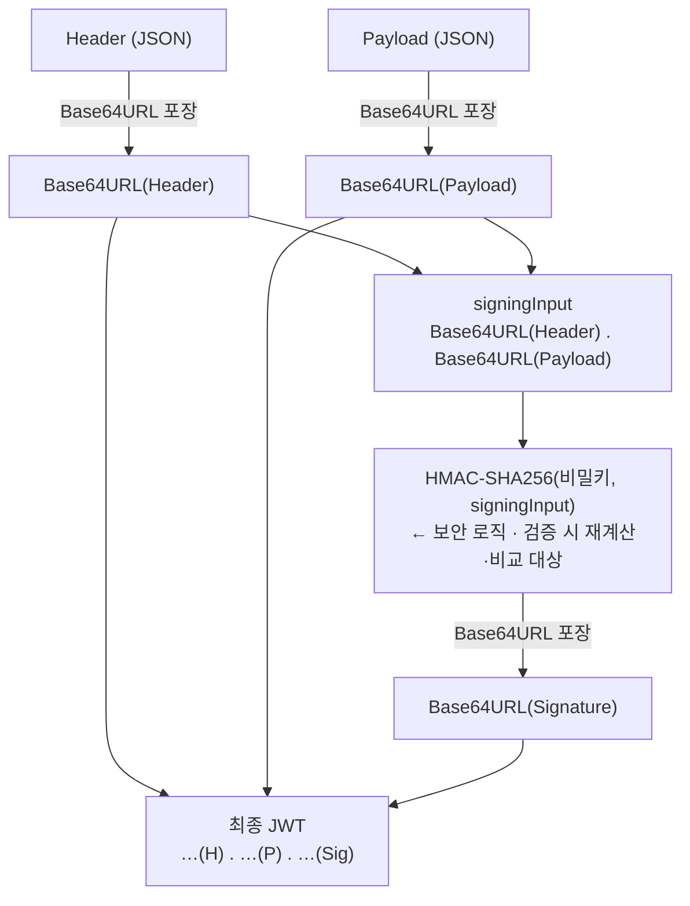
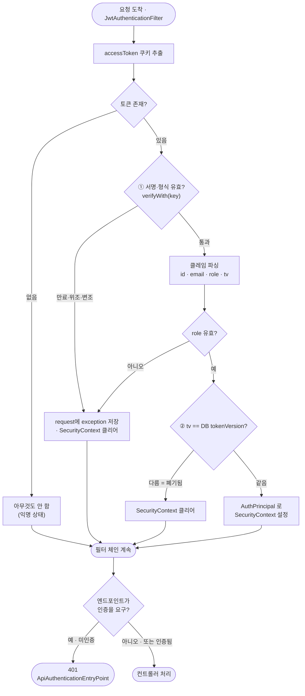

# JWT 토큰 발급·검증 처리

토큰 **하나가 만들어지고(발급) 검사받는(검증)** 내부 처리를 플로우차트로 본다.
로그인·로그아웃 등 상호작용 흐름은 [auth-flow.md](auth-flow.md), 폐기 원리(tokenVersion)는 [auth-flow.md#토큰-폐기-원리-tokenversion](auth-flow.md) 참고.

> 핵심: 서명은 **대칭키(HMAC-SHA)** 로 하고, 검증은 **두 관문**(① 서명 유효? ② 버전 일치?)을 모두 통과해야 한다. 필터는 실패해도 직접 401을 던지지 않고, **컨텍스트를 비운 뒤 체인을 계속**한다 — 401은 이후 인가 단계에서 `EntryPoint`가 낸다.

---

## 발급 (issue) — `TokenProviderAdapter.issueTokenPair`

> access·refresh는 **클레임이 동일**하고 **만료(exp)만 다르다**. 같은 대칭키로 서명한다.

> `tv`(tokenVersion)를 클레임에 심는 지점이 여기다. 이 값이 **서명 안에 들어가** 이후 위조가 불가능해진다. 비밀키가 짧으면(<256bit) `Keys.hmacShaKeyFor`가 예외를 던진다.

---

## Base64(포장)와 서명(보안)은 다른 계층

> 토큰에는 성격이 다른 두 층이 겹쳐 있다. **Base64는 보안이 아니라 "URL-안전 봉투"** 다 — 개념에서 Base64를 지워도 서명·검증 원리는 그대로다.

| 계층 | 하는 일 | 요소 |
|---|---|---|
| **보안 로직** | 위·변조 차단 | `HMAC(비밀키, signingInput)` 를 재계산해 비교 |
| **전송 포장(Base64URL)** | URL·쿠키에 실을 문자열화 | `Base64URL(Header)` · `Base64URL(Payload)` · `Base64URL(Signature)` |

아래에서 **Base64URL 포장은 3곳(H·P·Sig)**, **HMAC(보안)은 1곳**뿐이다.

> - **서명 대상은 raw JSON이 아니라 `signingInput`**(인코딩된 `H.P`)이다 — 같은 JSON도 공백·키 순서로 바이트가 달라질 수 있어, 양쪽이 **바이트 단위로 똑같은 것**을 서명·검증하도록 인코딩된 문자열을 기준 삼는다.
> - **`+비밀키` 이어붙이기 해시가 아니라 `HMAC(비밀키, …)`** 로 서명한다.
> - Base64는 **암호화가 아니다.** `Header`·`Payload`는 누구나 디코드해 읽을 수 있고(공개), 세 번째 조각(서명)만이 변조를 막는다.

---

## 검증 (verify) — `JwtAuthenticationFilter` + `TokenProviderAdapter.parseToken`

> 매 요청에 걸리는 횡단 처리. 분기가 많아 플로우차트가 가장 잘 맞는다.

> 실패 경로(토큰 없음·서명 실패·role 이상·버전 불일치)는 모두 **컨텍스트를 비우고 체인을 계속**한다. 그래서 최종 401 여부는 **엔드포인트가 인증을 요구하는지**에 달렸다 — 공개 API면 익명으로 통과, 인증 필요 API면 `EntryPoint`가 401을 낸다.

---

## 예외 처리 요약

| 상황 | 필터 처리 | 결과 |
|---|---|---|
| 토큰 없음 | 통과(익명) | 인증 필요 API면 401 |
| 만료(`ExpiredJwtException`) | exception 속성 저장 · 컨텍스트 클리어 | 401 (만료 메시지) |
| 위조·형식 오류(`JwtException`·`SecurityException` 등) | 〃 | 401 |
| role 클레임 이상 | `parseToken`이 `JwtException` → 〃 | 401 |
| 버전 불일치(폐기) | 컨텍스트 클리어(예외 아님) | 인증 필요 API면 401 |
| 모두 통과 | `AuthPrincipal` 등록 | 컨트롤러 처리 |

---

## 구성 요소 (클래스 매핑)

| 단계 | 클래스 · 포트 |
|---|---|
| 발급·파싱 | `TokenProviderAdapter` (`IssueTokenPort` · `ParseTokenPort`) — JJWT, HMAC-SHA |
| 요청 가로채기 | `JwtAuthenticationFilter` (`common.security`, 횡단) |
| 토큰 해석 | `ResolveTokenSharedPort` → `ResolveTokenUseCase` |
| 버전 검증 | `ValidateTokenVersionSharedPort` → `ValidateTokenVersionUseCase` → `LoadTokenVersionPort` |
| 401 응답 | `ApiAuthenticationEntryPoint` |
| 쿠키 구성 | `AuthCookieUtils` (`hirecore.cookie` 속성) |

> 필터는 `common` 에 있고 account 유스케이스를 **sharedkernel 공용 포트**로 호출한다. 대칭키·비대칭키 등 서명 방식의 배경은 [auth-flow.md](auth-flow.md) 참고.
