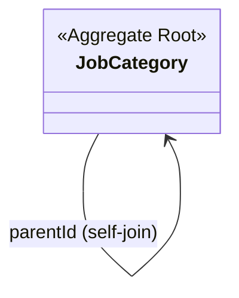

# category 도메인 모델

직무 분류를 **self-join 트리**로 보관한다. 계층 경로 조립·조회 흐름은 [job-category-hierarchy.md](job-category-hierarchy.md) 참고.

## 구성 (클래스 다이어그램)

## 애그리거트 · 규칙

| 애그리거트 | 역할 | 특징 |
|---|---|---|
| `JobCategory` | 직무 분류 트리 노드 | `parentId` 로 부모 참조(루트는 null). 복원용 builder만 존재(팩토리 메서드 없음) |

## 상태 · 플래그

| 필드 | 의미 |
|---|---|
| `depth` | 트리 깊이 |
| `isActive` | 노출/조회 대상 여부 |
| `isAssignable` | 직접 매핑 가능 여부 |
| `allowsCustomInput` | 사용자 정의 직무명 입력 허용 |
| `sortOrder` | 정렬 순서 |

> 계층 경로(root→leaf)는 도메인이 아니라 **애플리케이션/쿼리(재귀 CTE)** 에서 조립한다.
