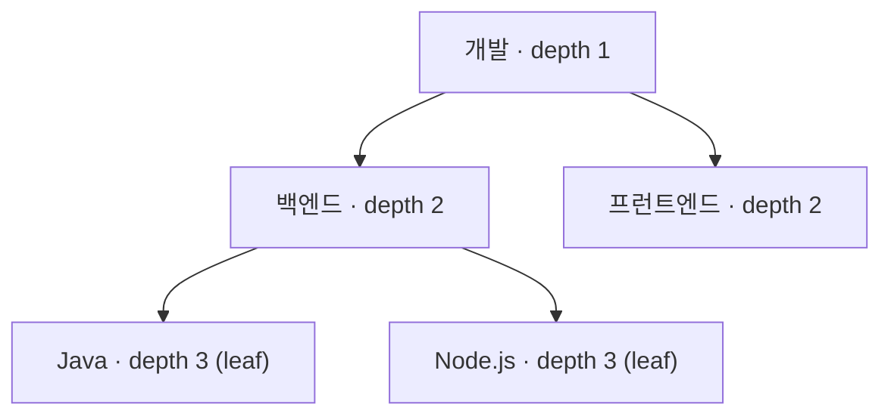
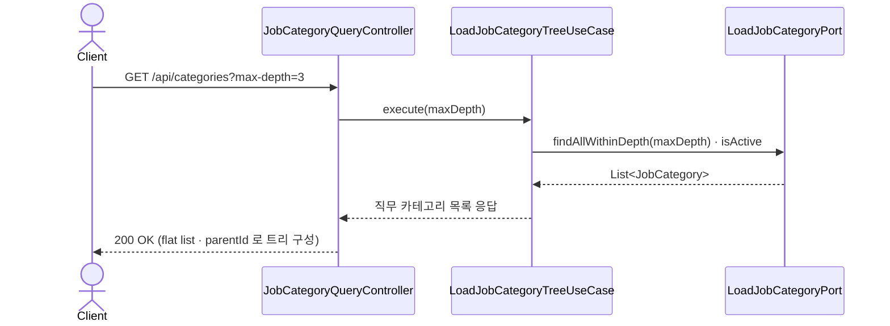
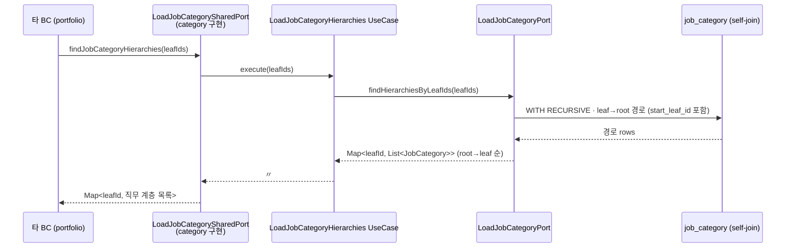
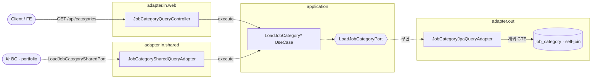

# 직무 카테고리 계층 조회

`category` 는 직무를 **self-join 트리**로 보관하고, 두 가지로 노출한다 — 프런트용 **트리 조회(공개 API)** 와 타 BC 태깅용 **계층 경로 조회(공용 포트)**.
계층 일반론은 [../ARCHITECTURE.md](../ARCHITECTURE.md) 참고.

## 구조 (self-join 트리)

`JobCategory` 는 `parentId` 로 부모를 가리켜 트리를 이룬다. `depth` 로 레벨을, `isActive`·`isAssignable`·`allowsCustomInput`·`sortOrder` 로 노출·매핑 규칙을 표현한다.

> 계층 경로는 도메인이 아니라 **쿼리(재귀 CTE)** 로 조립한다. self-join 을 leaf→root 로 거슬러 올라간다.

---

## 흐름 1 · 트리 조회 (공개 API)

---

## 흐름 2 · 계층 경로 조회 (타 BC 태깅)

`portfolio` 등이 직무 태그를 붙일 때, leaf id 들의 `root→leaf` 경로를 **한 번에** 받아간다.

> 태그 저장 시 코드→ID 변환은 `findIdByCode(categoryCode)` 로 한다(존재하지 않으면 404 `JOB_CATEGORY_CODE_NOT_FOUND`).

---

## 설계 포인트

- **재귀 CTE**: leaf→root 경로를 단일 SQL로 조회해 N+1 을 피한다.
- **bulk 최적화**: `start_leaf_id` 컬럼으로 여러 leaf 의 경로를 한 쿼리로 조회 후 `Map` 으로 그룹화한다.
- **공용 DTO 최소화**: 타 BC 에는 `LoadJobCategorySharedPort.Result(id, depth, categoryCode, name)` 만 노출한다(`isAssignable` 등 내부 플래그 제외).

---

## 구조 · 헥사고날 계층

- 공개 트리는 `web` 컨트롤러로, 타 BC 계층 조회는 `adapter.in.shared` 로 들어와 **같은 유스케이스**를 쓴다.
