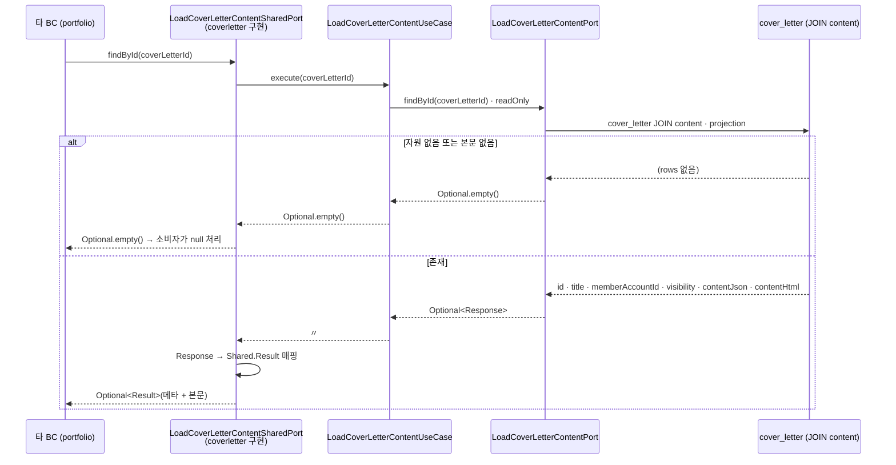
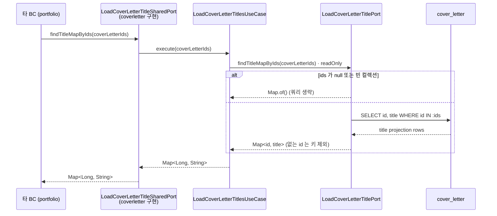
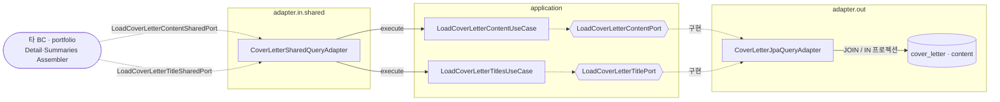

# 자기소개서 본문·제목 조회 흐름

`coverletter` 의 두 읽기 유스케이스 — **본문 단건 조회**(`LoadCoverLetterContentUseCase`) 와 **제목 목록 일괄 조회**(`LoadCoverLetterTitlesUseCase`) — 를 다룬다.
`resume` 와 **동일한 구조**로, 이 BC 는 **자체 web 컨트롤러가 없다**. 두 유스케이스는 오직 `sharedkernel` 공용 포트를 통해 **타 BC(portfolio)** 에서만 소비된다.
애그리거트·자식 구성은 [domain-model.md](domain-model.md) 참고.

> 핵심: coverletter 는 자원의 **메타(제목·소유자·가시성)와 본문(json·html)** 만 공용 포트로 노출하고, **본문 노출 여부(가시성 정책) 판단은 소비자(portfolio)** 가 한다. 조회 결과는 예외가 아니라 `Optional.empty` / 빈 `Map` 으로 "없음" 을 표현한다.

---

## 흐름 1 · 본문 단건 조회 (`LoadCoverLetterContentUseCase`)

`portfolio` 상세에서 연결된 자기소개서 본문을 합성할 때 쓴다. 유입은 web 이 아니라 공용 포트다.

> 본문은 `CoverLetterContent` 와의 **JOIN 프로젝션**으로 메타와 한 번에 적재한다(내부 조인이라 본문 row 가 없으면 결과 없음).
> `Result` 에 `memberAccountId` 와 `visibility` 를 함께 실어, 소비자가 "자원 가시성 + viewer 일치" 로 본문 마스킹을 결정하게 한다.

---

## 흐름 2 · 제목 목록 일괄 조회 (`LoadCoverLetterTitlesUseCase`)

`portfolio` 목록에서 연결된 자기소개서 제목만 필요할 때, id 들을 모아 **한 번에** 받아간다.

> 존재하지 않는 id 는 결과 맵에 **키가 포함되지 않는다**. 소비자는 제목이 없으면 연결 자원을 `null` 로 접는다.

---

## 소비 지점 · 타 BC(portfolio)

| 소비 유스케이스 | 진입 엔드포인트 | 사용 포트 | 본문/제목 처리 |
|---|---|---|---|
| `LoadPortfolioDetailUseCase` → `PortfolioDetailAssembler.buildLinkedCoverLetter` | `GET /api/portfolios/{id}` (비로그인 허용) | `LoadCoverLetterContentSharedPort` | `findById` 후 **가시성 판정**: `PUBLIC` 이거나 viewer==소유자면 본문 포함, 아니면 **메타만**(제목만) |
| `LoadMyPortfolioSummariesUseCase` → `MyPortfolioSummariesAssembler.buildItems` | `GET /api/portfolios/summaries/mine` (인증 필요) | `LoadCoverLetterTitleSharedPort` | 연결된 자기소개서 id 들을 **bulk 조회**해 제목만 매핑 |

> 본문 노출 정책(`canViewContent`)은 **portfolio 어셈블러**에 있다. coverletter BC 내부에는 소유권·가시성 검증이 없고, 자원 자체의 `visibility`·`memberAccountId` 만 넘겨준다.

---

## 없음·마스킹 처리

| 상황 | 결과 |
|---|---|
| 존재하지 않는 자기소개서 (본문 조회) | `Optional.empty()` → 소비자에서 연결 자원 `null` |
| 본문 row 없음 (JOIN 미스) | `Optional.empty()` (예외 아님) |
| `ids` 가 null / 빈 컬렉션 (제목 조회) | `Map.of()` — 쿼리 생략 |
| 존재하지 않는 id 포함 (제목 조회) | 해당 id 는 결과 맵에서 제외 |
| 비공개(PRIVATE) 자원 · viewer 불일치 | 본문 마스킹(제목만 노출) — **portfolio 어셈블러** 판정 |

---

## 구조 · 헥사고날 계층

> 이 BC 는 web 진입이 없다. `adapter.in.shared` 의 단일 어댑터가 두 공용 포트를 구현하고, portfolio 어셈블러가 이를 주입받아 소비한다.

- `{{...}}`(육각형) = 포트(interface). `CoverLetterSharedQueryAdapter` 하나가 **두 sharedkernel 공용 포트**를 구현하고, 내부 유스케이스로 위임한다.
- `CoverLetterJpaQueryAdapter` 하나가 `LoadCoverLetterContentPort` · `LoadCoverLetterTitlePort` 를 함께 구현한다(본문은 JOIN, 제목은 `IN` 프로젝션).
