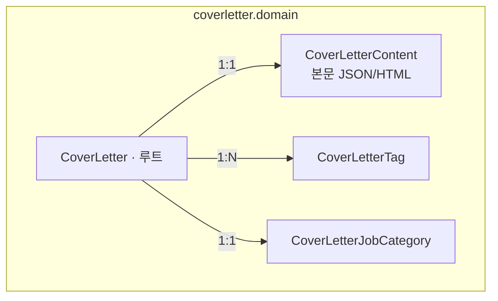

# coverletter 도메인 모델

자기소개서 작업물을 관리한다. `resume` 와 동일한 구조이며 **조회/관심 추적·도메인 이벤트가 없다**.

## 구성

## 애그리거트 · 불변식

| 요소 | 역할 | 비고 |
|---|---|---|
| `CoverLetter` | 루트 | `create()` 로 생성. `portfolioIds`(List)로 연계. 이벤트 미발행 |
| `CoverLetterContent` | 본문 | `@MapsId` 로 부모 ID 공유 |
| `CoverLetterTag` / `CoverLetterJobCategory` | 태그 / 직무 | portfolio 와 동일 개념 |

## 값 객체 · 상태

| VO | 값 |
|---|---|
| `CoverLetterStatus` | `TEMP_SAVE` · `PUBLISHED` |
| 공유 VO | `Visibility` · `CollaborationType` · `ExternalLink` · `AuditingInfo` |

> 본문은 다른 BC(portfolio)가 공용 포트로 가져간다 — 계약은 sharedkernel `CoverLetterContentResult`.
