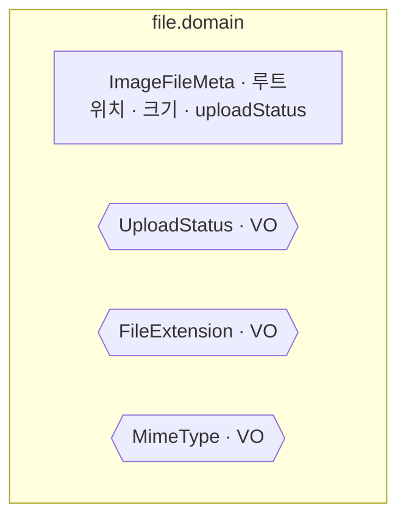

# file 도메인 모델

이미지 파일 메타를 관리하는 애그리거트. **상태 머신**이 핵심이다. 상태 생애주기와 전이 흐름(확정·고아화·정리)은 [image-lifecycle.md](image-lifecycle.md) 참고.

## 구성

## 애그리거트 · 상태 전이

| 메서드 | 전이 | 보장 |
|---|---|---|
| `create()` | → `PENDING` | presigned 발급 시 메타 선기록 |
| `markUploaded()` | `PENDING` → `UPLOADED` | 참조 확정 → `ImageUploadedEvent` |
| `markOrphaned()` | `UPLOADED` → `ORPHANED` | 참조 해제 → `ImageOrphanedEvent` |
| `markDeleted()` | `ORPHANED` → `DELETED` | 정리 배치(종료 상태, 이벤트 없음) |
| `isOwnedBy(member)` | — | 소유권 검증 |

> 상태 전이는 **정해진 경로만** 허용(역진행 불가)하고, 각 전이 시 timestamp 를 남긴다.

## 값 객체

| VO / enum | 값 |
|---|---|
| `UploadStatus` | `PENDING` · `UPLOADED` · `ORPHANED` · `DELETED` |
| `FileExtension` | `WEBP` (현재) |
| `MimeType` | `IMAGE_WEBP` (현재) |

## 도메인 이벤트

| 이벤트 | 발행 | 구독 |
|---|---|---|
| `ImageUploadedEvent` | `markUploaded()` | storage · 사용량 증가 |
| `ImageOrphanedEvent` | `markOrphaned()` | storage · 사용량 감소 |
