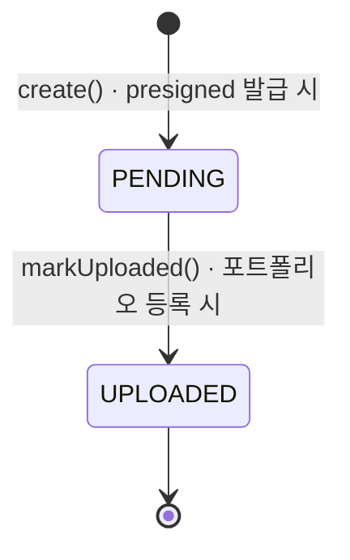

# 이미지 파일 메타 — 업로드 상태 전이

> `file` 모듈. presigned URL 발급 시 `PENDING` 으로 생성되고, 참조가 확정될 때 `UPLOADED` 로 전이합니다.

- **PENDING**: 메타만 선기록된 상태. S3 실제 업로드 여부는 서버가 알지 못한다.
- **UPLOADED**: 참조가 확정된 상태. 이후 저장 용량 사용량에 반영된다. 이미 `UPLOADED` 면 멱등 처리(skip).
