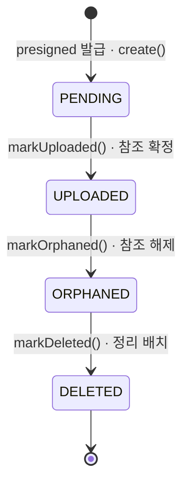
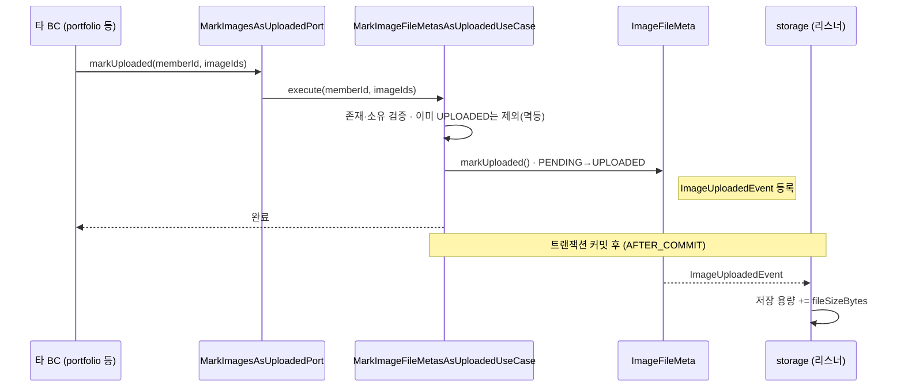
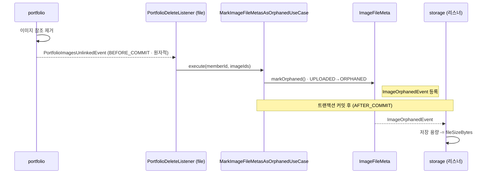
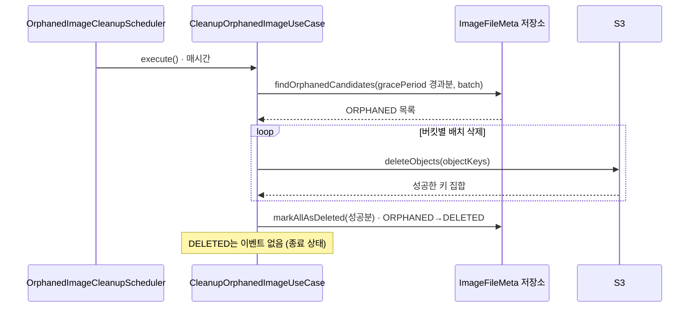

# 이미지 파일 메타 — file 도메인 흐름

`file` 모듈은 이미지의 **업로드부터 정리까지 생명주기**를 관리한다.
다른 BC(`portfolio` 등)는 이 모듈에 **공유 포트**로만 접근하고, 저장 용량은 `storage` BC가 **이벤트**로 동기화한다.

---

## 상태 생명주기

| 상태 | 의미 | 진입 계기 |
|---|---|---|
| `PENDING` | 메타만 선기록. S3 실제 업로드 여부는 서버가 모름 | presigned URL 발급 |
| `UPLOADED` | 참조가 확정됨. 저장 용량에 반영 | 타 BC의 `markUploaded()` |
| `ORPHANED` | 참조가 끊긴 회수 대기 상태 | 참조 해제 이벤트 |
| `DELETED` | S3 객체 삭제 완료(소프트 딜리트, 종료 상태) | 정리 배치 |

> 물리 삭제가 아니라 **상태 전이(소프트 딜리트)** 다. `ORPHANED`에 유예기간(gracePeriod)을 둬 실수 복구 여지를 남긴다.

---

## 흐름 1 · 업로드 확정 (PENDING → UPLOADED)

발급 단계(`PENDING` 생성)의 상세 시퀀스는 [포트폴리오 등록 플로우](../portfolio/register-flow.md)를 참고.
여기서는 **타 BC가 업로드 완료를 확정**하는 교차 호출을 다룬다.

---

## 흐름 2 · 참조 해제 (UPLOADED → ORPHANED)

`portfolio` 등에서 이미지 참조가 사라지면 이벤트로 알리고, `file`이 해당 이미지를 고아 처리한다.

---

## 흐름 3 · 정리 배치 (ORPHANED → DELETED)

스케줄러가 주기적으로 유예기간이 지난 고아 이미지를 S3에서 실제 삭제하고 종료 상태로 전이한다.

---

## 이벤트 · 저장 용량 동기화

용량 변경은 `file`이 직접 하지 않고, 발행한 도메인 이벤트를 `storage` BC가 **커밋 이후** 받아 반영한다.

| 이벤트 | 발행 시점 | storage 반영 |
|---|---|---|
| `ImageUploadedEvent` | `markUploaded()` (PENDING→UPLOADED) | 용량 **증가** |
| `ImageOrphanedEvent` | `markOrphaned()` (UPLOADED→ORPHANED) | 용량 **감소** |
| (없음) | `markDeleted()` (ORPHANED→DELETED) | 반영 없음 |

- 리스너는 `AFTER_COMMIT` 단계에서 동작한다. (전파 패턴 상세는 별도 노트 참고)
- `(memberAccountId, imageFileMetaId)` 유니크 제약으로 **멱등** 처리된다.
