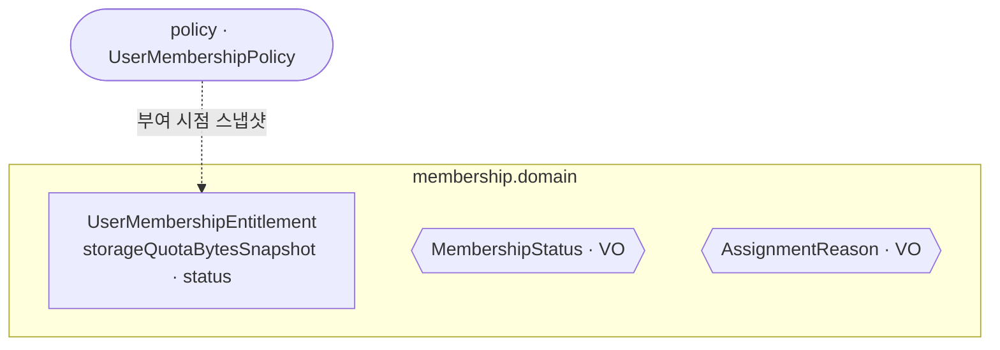

# membership 도메인 모델

회원에게 부여된 **멤버십 권리**를 관리한다. 부여 시점의 정책을 **스냅샷**으로 보관해 이후 정책 변경에 영향받지 않는다. 할당량 사용 흐름은 [../storage/storage-usage.md](../storage/storage-usage.md) 참고.

## 구성

## 애그리거트

| 애그리거트 | 역할 | 특징 |
|---|---|---|
| `UserMembershipEntitlement` | 회원별 멤버십 권리(상태·유효기간·할당량 스냅샷) | `storageQuotaBytesSnapshot`·`membershipName/ContentSnapshot` 을 부여 시점 값으로 고정 |

## 값 객체 · 상태

| VO / enum | 값 |
|---|---|
| `MembershipStatus` | `ACTIVE` · `EXPIRED` · `REVOKED` (상태 전이 로직은 현재 없음) |
| `AssignmentReason` | `PAYMENT` · `FREE` |

> 현재는 **데이터 모델 중심**(상태 전이 메서드·도메인 이벤트 미구현)이다.
