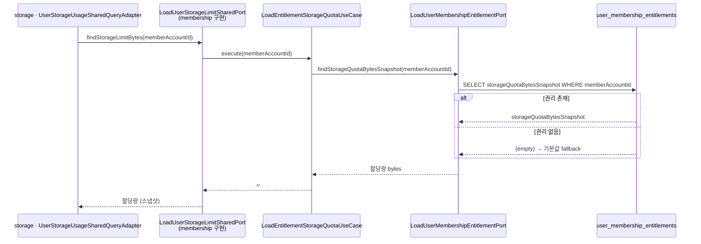
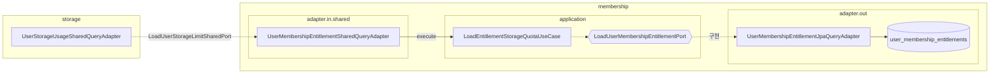

# 권리 스토리지 할당량 조회

`membership` 은 회원의 **멤버십 권리(entitlement)** 에 부여 시점 스냅샷으로 고정된 스토리지 할당량을 보관하고, 이를 **공용 포트로만** 노출한다. 할당량이 사용량과 합쳐져 업로드 가능 여부를 판정하는 전체 흐름은 [../storage/storage-usage.md](../storage/storage-usage.md), 스냅샷 개념은 [domain-model.md](domain-model.md) 참고.

> **web 엔드포인트 없음.** `LoadEntitlementStorageQuotaUseCase` 는 컨트롤러(`adapter.in.web`) 없이 `adapter.in.shared` 의 공용 포트(`LoadUserStorageLimitSharedPort`)로만 구동된다 — 주 소비자는 `storage` BC 의 용량 검증이다.
> 할당량은 `UserMembershipEntitlement.storageQuotaBytesSnapshot` 에 **부여 시점 스냅샷**으로 고정되어, 정책이 바뀌어도 소급되지 않는다.

## 흐름 · 공용 포트로 할당량 조회

`storage` 가 용량을 검증할 때, 회원의 스냅샷 할당량을 공용 포트로 받아간다. (그 앞단인 `file` 의 발급 전 검증 진입은 [../storage/storage-usage.md](../storage/storage-usage.md) 흐름 1 참고.)

---

## 조회 분기

| 조건 | 결과 |
|---|---|
| 회원 권리 존재 | `storageQuotaBytesSnapshot` 반환 |
| 회원 권리 없음 | 예외 없이 **기본값 fallback** 반환 (현재 임시 40 MiB, `todo` 로 표기) |

> 조회 실패(예외)는 없다 — `Optional.orElse(...)` 로 항상 값을 돌려주므로, 소비자(`storage`)는 `null` 없이 할당량을 받는다.

---

## 설계 포인트

- **스냅샷**: 할당량은 부여 시점 값으로 고정 → 정책 변경이 소급되지 않는다.
- **읽기 전용**: 유스케이스는 `@Transactional(readOnly = true)`, 스칼라(`storageQuotaBytesSnapshot`) 한 컬럼만 조회한다.
- **공용 포트 전용**: web 노출 없이 `sharedkernel` 의 `LoadUserStorageLimitSharedPort` 로만 타 BC 에 열린다.
- **fallback**: 권리 미존재 시 임시 기본값을 돌려주는 `todo` 가 있어, 정식 정책 연동 시 정리 대상이다.

---

## 구조 · 헥사고날 계층

- `storage` 는 `sharedkernel` 의 `LoadUserStorageLimitSharedPort` 를 통해 진입하고, `membership` 의 `adapter.in.shared` 어댑터가 이를 구현해 유스케이스로 위임한다.
