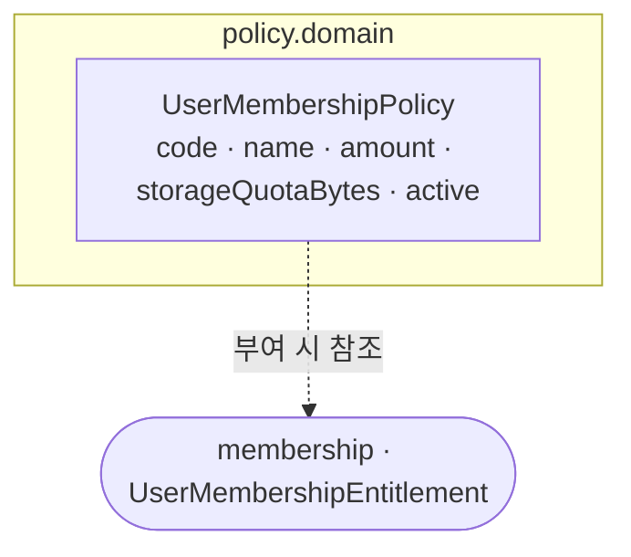

# policy 도메인 모델

멤버십 **정책(상품) 정의**를 보관한다. 회원에게 권리를 부여할 때 참고하는 원본이다.

## 구성

## 애그리거트

| 애그리거트 | 역할 | 불변식 |
|---|---|---|
| `UserMembershipPolicy` | 멤버십 상품 정의(이름·비용·스토리지 할당량) | 모든 필드 필수. `active` 로 활성화 제어 |

> 현재는 **데이터 모델 중심**(도메인 로직·이벤트 미구현)이다. 정책을 수정해도 이미 부여된 권리에는 영향이 없다 — [../membership/domain-model.md](../membership/domain-model.md) 의 스냅샷 참고.
