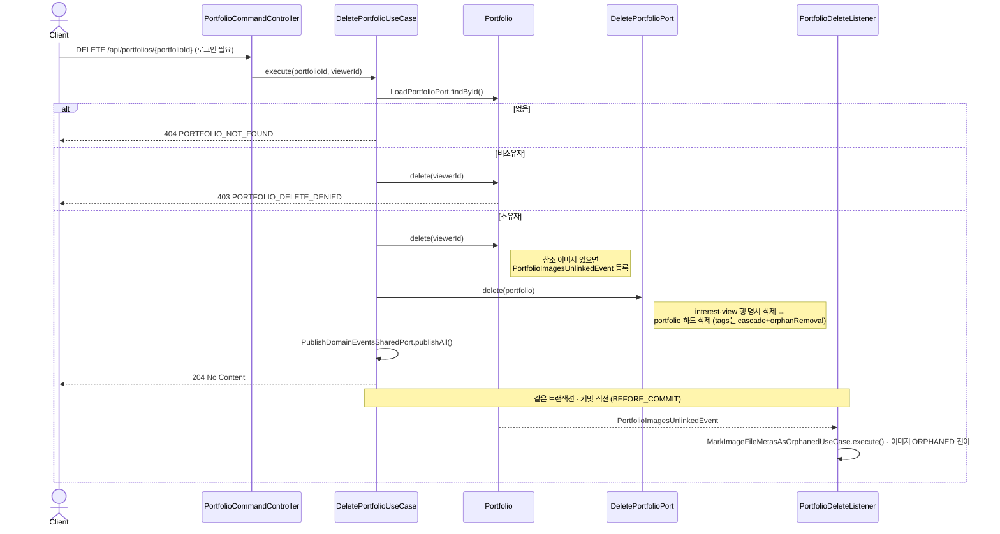

# 포트폴리오 삭제 흐름

포트폴리오를 **영구 삭제(hard delete)** 하고, 참조 이미지는 `file` BC 로 넘겨 고아화하는 한 사이클을 다룬다.
등록 사이클은 [register-flow.md](register-flow.md), 애그리거트 구조는 [domain-model.md](domain-model.md) 참고.

> 핵심: 실제 삭제다(soft delete 아님). 태그는 **cascade + orphanRemoval** 로 함께 지워지고, 조회·관심 기록 행은 **명시 삭제**한다. 참조 이미지는 **도메인 이벤트**로 `file` BC 에 넘긴다 — save 없는 경로라 `publishAll` 을 **명시 호출**한다.

---

## 삭제 흐름

> 소유 검증 → 이미지 unlink 이벤트 등록 → 하드 삭제 → 이벤트 발행 순.



---

## 실패 분기

| 상황 | 응답 |
|---|---|
| 포트폴리오 없음 | 404 (`PORTFOLIO_NOT_FOUND`) |
| 소유자가 아님 | 403 (`PORTFOLIO_DELETE_DENIED`) |

> **삭제 처리 특성**
> - **하드 삭제**: `entityManager.find` 로 managed 엔티티를 잡아 `delete` — 실제 행 제거.
> - **태그**: `@OneToMany(cascade = ALL, orphanRemoval = true)` → 포트폴리오 삭제 시 함께 제거.
> - **조회·관심 기록**: 애그리거트 밖 별도 테이블이라 cascade 안 됨 → `deleteAllByPortfolioId` 로 명시 정리.
> - **이미지 회수**: 참조 이미지가 있을 때만 이벤트 등록. `save` 없는 경로라 `publishAll` 을 명시 호출한다.
> - **이벤트 시점**: `BEFORE_COMMIT` — 삭제와 이미지 고아화를 **같은 트랜잭션**에서 원자적으로 처리한다.

---

## 구조 · 헥사고날 계층

> 삭제 유스케이스의 계층 흐름. 의존은 `adapter.in → application(port) → domain`, `application(port) ← adapter.out`.
> 애플리케이션은 **포트(interface)에만** 의존하고, 어댑터가 이를 구현한다. (전체 아키텍처는 [../ARCHITECTURE.md](../ARCHITECTURE.md) 참고)

```mermaid
flowchart LR
    Client([Client / FE])

    subgraph web[adapter.in.web]
        Ctrl[PortfolioCommandController]
    end
    subgraph app[application]
        UC[DeletePortfolioUseCase]
        LoadP{{LoadPortfolioPort}}
        DelP{{DeletePortfolioPort}}
        Pub{{PublishDomainEventsSharedPort}}
    end
    subgraph domain[domain]
        PF[Portfolio]
    end
    subgraph out[adapter.out]
        PC[PortfolioJpaCommandAdapter]
        DB[(portfolio RDB)]
    end
    subgraph file[file 모듈 · adapter.in.event]
        L[PortfolioDeleteListener]
        FUC[MarkImageFileMetasAsOrphanedUseCase]
    end

    Client -->|DELETE /api/portfolios/{id}| Ctrl
    Ctrl -->|execute| UC
    UC --> PF
    UC -.-> LoadP
    UC -.-> DelP
    UC -.-> Pub
    LoadP -.->|구현| PC
    DelP -.->|구현| PC
    PC --> DB
    PF -. 이벤트 .-> L
    L --> FUC
```

- `{{...}}`(육각형) = 포트(interface).
- BC 경계를 넘는 이미지 고아화는 **도메인 이벤트**로만 이루어지며, `file` 모듈의 리스너가 `MarkImageFileMetasAsOrphanedUseCase` 로 소비한다.
- 도메인 애그리거트·자식 엔티티·불변식은 [domain-model.md](domain-model.md) 로 분리했다.
