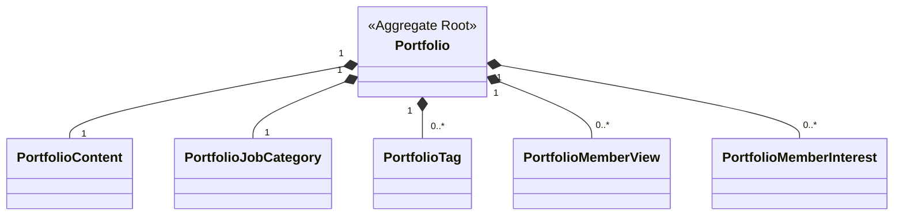

# portfolio 도메인 모델

포트폴리오 작업물과 그 상호작용(조회·관심) 기록을 관리하는 애그리거트다.
등록 흐름은 [register-flow.md](register-flow.md), 조회·관심 흐름은 [view-and-interest-flow.md](view-and-interest-flow.md) 참고.

## 구성 (클래스 다이어그램)

> 공통 `AuditingInfo` 는 생략한다.

## 애그리거트 · 불변식

| 요소 | 역할 | 불변식/정책 |
|---|---|---|
| `Portfolio` | 루트. 소유자만 수정, 조회/관심 캐시 카운트 보유 | title 1~80 · previewSummary 1~100 · tags ≤10 · externalLinks ≤6 |
| `PortfolioContent` | 본문(JSON/HTML) + 임베드 이미지 추적 | `@MapsId` 로 부모 ID 공유. `imageIds` 로 고아 이미지 판정 |
| `PortfolioTag` | 태그 | `normalizedTag`(소문자·공백→_) |
| `PortfolioJobCategory` | 직무 선택 | `leafJobCategoryId`(category BC) + `userInput`(≤10) |
| `PortfolioMemberView` / `PortfolioMemberInterest` | 조회/관심 기록 | `UNIQUE(portfolio, member)` |

## 핵심 도메인 메서드

| 메서드 | 보장 |
|---|---|
| `create()` | 필수 검증 후 생성(TSID · cachedCount=0) |
| `modify()` | 소유자만. 이미지 변경 시 `PortfolioImagesUnlinkedEvent` |
| `markViewedBy(viewer, alreadyViewed)` | 소유자·재조회 제외 시 `PortfolioViewedEvent` |
| `registerInterestBy(member, already)` | 소유자·비공개 거부, 중복 멱등 → `PortfolioInterestRegisteredEvent` |
| `cancelInterestBy(member)` | `PortfolioInterestCancelledEvent`(멱등) |
| `isViewableBy(member)` | PUBLIC 전체 / PRIVATE 소유자 |
| `referencedImageIds()` | 썸네일+본문 이미지(중복제거·순서보존) |

## 값 객체 · 상태

| VO / enum | 값 · 의미 |
|---|---|
| `PortfolioStatus` | `TEMP_SAVE` · `PUBLISHED` |
| `ReferencedImageIds` | 참조 이미지 집합. `minus()` 차집합으로 고아 판정 |
| `Visibility` (공유) | `PUBLIC` · `PRIVATE` |
| `CollaborationType` (공유) | `TEAM` · `PERSONAL` |
| `ExternalLink` · `Purpose` · `DomainType` (공유) | 외부링크 / 이미지 용도 / 도메인 종류 |

## 도메인 이벤트

| 이벤트 | 발행 | 구독 |
|---|---|---|
| `PortfolioViewedEvent` | `markViewedBy()` | (내부) 조회수 + · 조회기록 |
| `PortfolioInterestRegistered/CancelledEvent` | `register/cancelInterestBy()` | (내부) 관심수 ± · 기록 |
| `PortfolioImagesUnlinkedEvent` (공유) | `modify()` · `delete()` | file · 이미지 고아화 |
