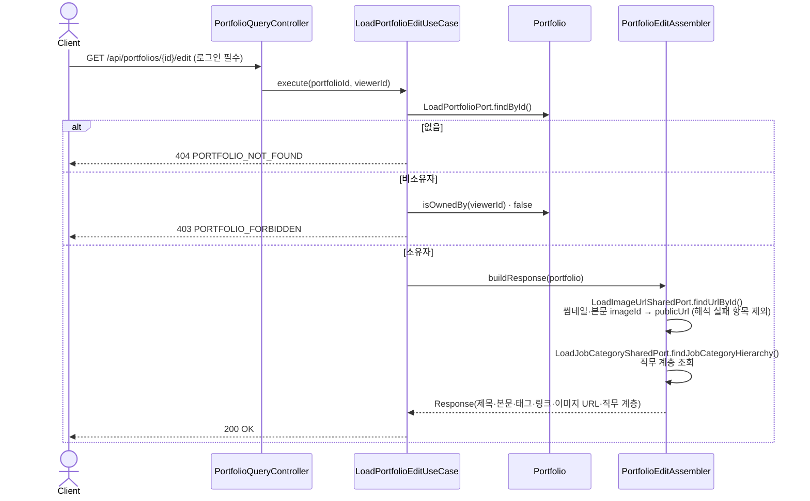
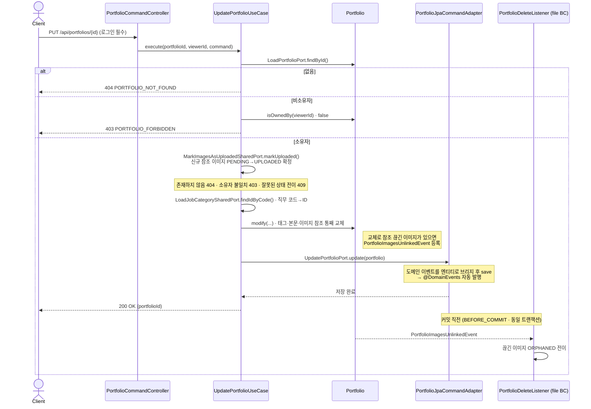
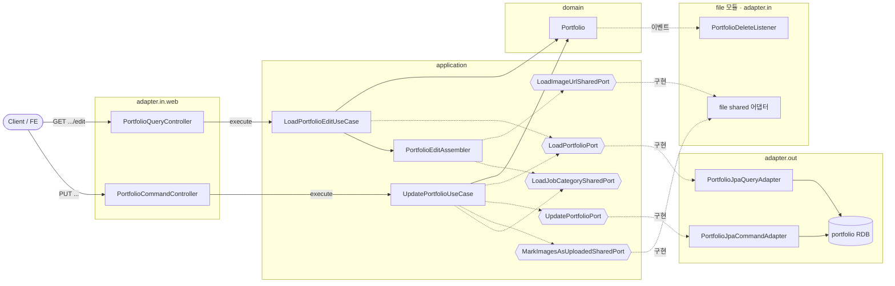

# 포트폴리오 편집·수정 흐름

작성자 본인이 **편집 폼을 조회**(`GET …/edit`)한 뒤 **수정 저장**(`PUT …`)하는 한 쌍의 흐름을 다룬다.
최초 등록 사이클은 [register-flow.md](register-flow.md), 도메인 모델 구조는 [domain-model.md](domain-model.md) 참고.

> 핵심: 수정은 태그·본문·이미지 참조를 **통째로 교체**한다. 교체 결과 **참조가 끊긴 이미지**가 있으면 `Portfolio.modify()` 가 `PortfolioImagesUnlinkedEvent` 를 등록하고, `file` BC 리스너가 **같은 트랜잭션 커밋 직전**(`BEFORE_COMMIT`)에 해당 이미지를 고아(ORPHANED)로 전이한다. 새로 추가된 이미지는 `PENDING → UPLOADED` 로 확정한다.

---

## 1) 편집 폼 조회 (GET)

> 작성자 본인만 접근 가능한 읽기 유스케이스. 저장된 값을 편집 화면 초기 데이터로 조립한다.

---

## 2) 수정 저장 (PUT)

> 쓰기 유스케이스. 소유자 검증 → 신규 이미지 확정 → 도메인 통째 교체 → 저장. 저장 시 `@DomainEvents` 로 unlink 이벤트가 자동 발행된다.

---

## 실패 분기

| 상황 | 응답 |
|---|---|
| 포트폴리오 없음 | 404 (`PORTFOLIO_NOT_FOUND`) |
| 비소유자 접근 (조회·수정) | 403 (`PORTFOLIO_FORBIDDEN`) |
| 신규 이미지 확정 실패 (존재/소유/상태) | 404 · 403 · 409 |
| 직무 카테고리 코드 없음/비활성 | 404 (`JOB_CATEGORY_CODE_NOT_FOUND`) |
| 필수값 누락 (카테고리·협업유형·공개범위·제목·본문) | `…_MISSING` (Command 생성 시 검증) |
| 제목 80자 / 요약 100자 / 비공개메모 200자 초과 | `…_TOO_LONG` (도메인 불변식) |
| 외부 링크 6개 / 태그 10개 초과 | `…_TOO_MANY` (도메인 불변식) |
| 본문(content) JSON 직렬화 실패 | 500 (`CONTENT_JSON_SERIALIZATION_FAILED`) |

> **이벤트 처리 시점**
> - `PortfolioImagesUnlinkedEvent` 는 수정 저장의 `@DomainEvents` 경로로 발행되고, `file` BC 의 `@TransactionalEventListener(BEFORE_COMMIT)` 가 **같은 트랜잭션 안에서** 소비한다. 이미지 고아화가 커밋 전에 원자적으로 반영된다(수정 롤백 시 함께 롤백).
> - 참조가 끊긴 이미지가 없으면 이벤트 자체가 등록되지 않는다.

---

## 구조 · 헥사고날 계층

> 편집 폼 조회·수정 저장의 계층 흐름. 의존은 `adapter.in → application(port) → domain`, `application(port) ← adapter.out`.
> 애그리거트·자식·불변식 등 **도메인 모델은 [domain-model.md](domain-model.md)** 로 분리했다.

- `{{...}}`(육각형) = 포트(interface). BC 경계를 넘는 이미지 URL 조회·확정(`LoadImageUrlSharedPort`·`MarkImagesAsUploadedSharedPort`)은 **포트로만** 이루어지며 `file` 모듈의 shared 어댑터가 구현한다.
- 참조 해제 이미지의 고아화는 `PortfolioImagesUnlinkedEvent` 를 `file` BC 리스너가 소비해 수행한다.
