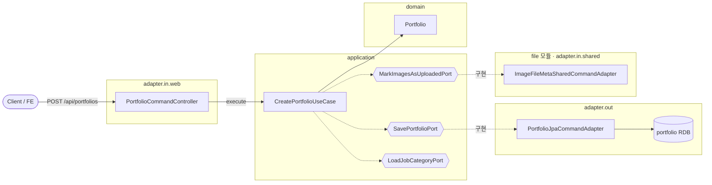

# 포트폴리오 등록 — 헥사고날 계층

> 의존 방향: `adapter.in → application(port) → domain`, 그리고 `application(port) ← adapter.out`.
> 애플리케이션은 **포트(interface)에만** 의존하고, 어댑터가 이를 구현합니다.

- `{{...}}`(육각형) = 포트(interface)
- BC 경계를 넘는 호출(`MarkImagesAsUploadedPort`)은 **포트로만** 이루어지며, `file` 모듈의 shared 어댑터가 구현합니다.
