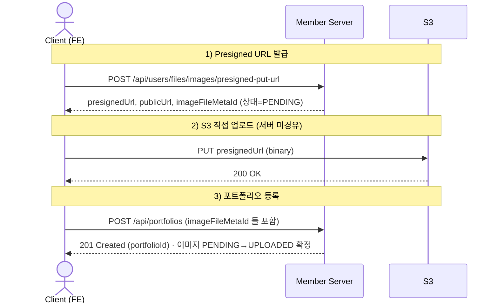
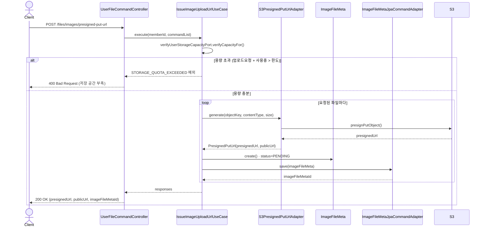
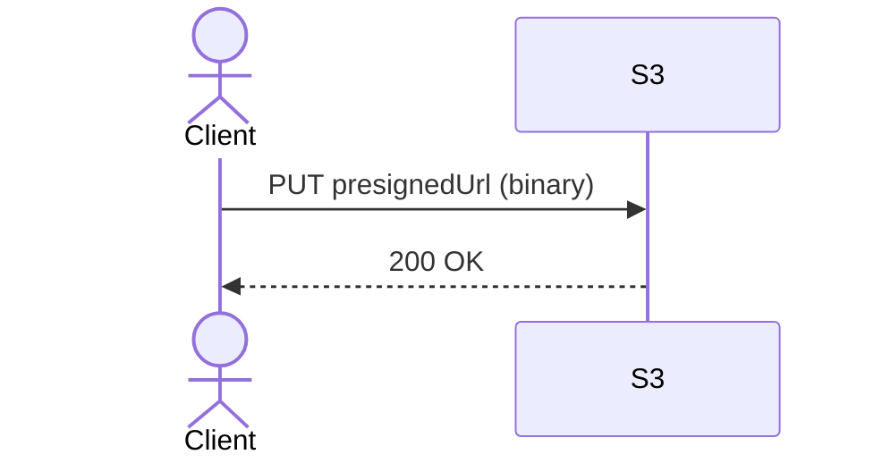
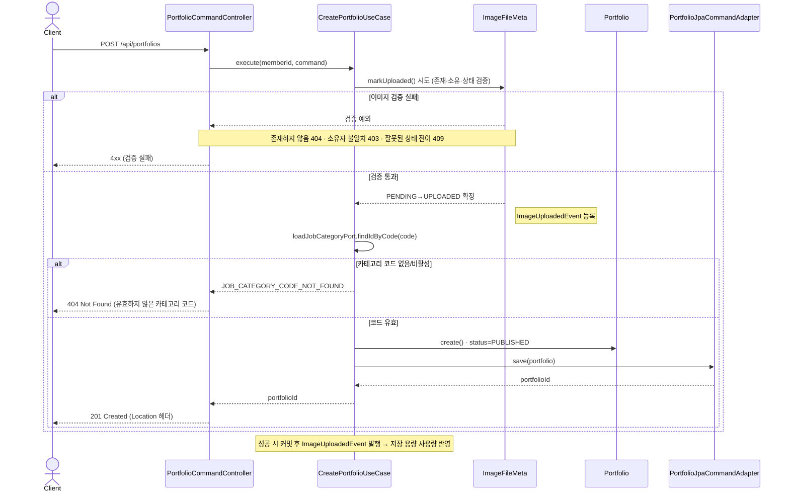
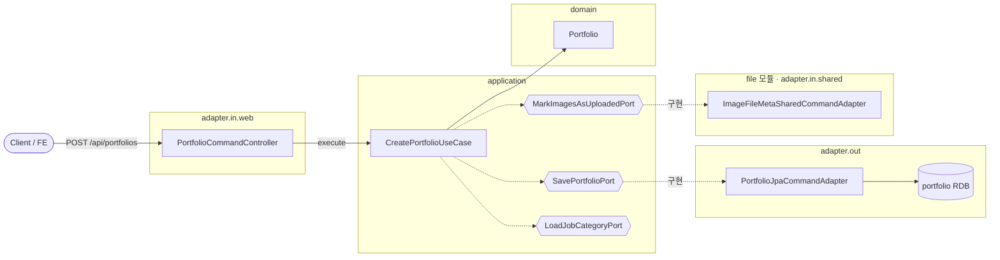

# 포트폴리오 등록 플로우

`Presigned URL 발급 → S3 직접 업로드 → 포트폴리오 등록` 한 사이클입니다.
`file` 모듈과 `portfolio` 모듈 두 BC에 걸쳐 있습니다.

## 계약 플로우 (Client ↔ Backend)

> 클라이언트 관점의 호출 순서. 내부 어댑터는 감춘 인터랙션 고도.

## 내부 처리 흐름

> 백엔드 개발자가 참조하는 실제 계층 흐름과 실패 분기.

### 1) Presigned URL 발급

### 2) S3 직접 업로드

서버를 거치지 않습니다. 이 시점에도 서버가 아는 상태는 여전히 `PENDING` 입니다.

### 3) 포트폴리오 등록

참조된 이미지를 `PENDING → UPLOADED` 로 확정한 뒤 포트폴리오를 저장합니다.

> 위 분기 외에, 본문(content) JSON 직렬화가 실패하면 `CONTENT_JSON_SERIALIZATION_FAILED` → **500 Internal Server Error**(기술적 오류)로 응답합니다.

---

## 구조 · 헥사고날 계층

> 위 흐름을 계층 관점에서 본 것. 의존 방향은 `adapter.in → application(port) → domain`, 그리고 `application(port) ← adapter.out`.
> 애플리케이션은 **포트(interface)에만** 의존하고, 어댑터가 이를 구현한다. (전체 아키텍처는 [../ARCHITECTURE.md](../ARCHITECTURE.md) 참고)

- `{{...}}`(육각형) = 포트(interface)
- BC 경계를 넘는 호출(`MarkImagesAsUploadedPort`)은 **포트로만** 이루어지며, `file` 모듈의 shared 어댑터가 구현한다.
