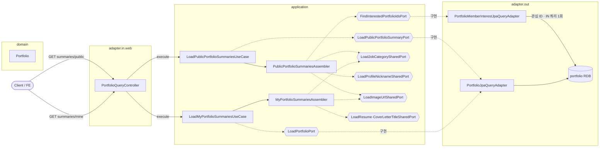

# 포트폴리오 목록(요약) 조회 흐름

포트폴리오 **목록 조회** 두 종류 — 본인 목록(`summaries/mine`)과 공개 목록(`summaries/public`) — 을 다룬다.
상세 조회·관심·조회수는 [view-and-interest-flow.md](view-and-interest-flow.md), 도메인 모델은 [domain-model.md](domain-model.md) 참고.

> 핵심: 공개 목록의 `isInterested`는 **항목마다 개별 조회하지 않는다**. 이번 페이지 전체 포트폴리오 ID를 모아 **IN 쿼리 1회**로 관심 등록분만 한 번에 가져온 뒤(`findInterestedPortfolioIds`), 그 집합의 포함 여부로 판정한다 (**N+1 회피**). 직무 계층(`findJobCategoryHierarchies`)도 같은 배치 전략을 쓴다.

---

## 본인 목록 (summaries/mine)

> 로그인 사용자 본인 포트폴리오 전체를 수정 시각 내림차순으로. 페이징 없음. 연결된 이력서·자기소개서 제목은 bulk 조회한다.

```mermaid
sequenceDiagram
    actor Client
    participant Ctrl as PortfolioQueryController
    participant UC as LoadMyPortfolioSummariesUseCase
    participant ASM as MyPortfolioSummariesAssembler
    participant P as LoadPortfolioPort

    Client->>Ctrl: GET /api/portfolios/summaries/mine (로그인 필요)
    Ctrl->>UC: execute(viewerId = authPrincipal.id())
    UC->>P: findAllByMemberAccountIdOrderByUpdatedAtDesc(viewerId)
    alt 결과 없음
        UC-->>Client: 200 OK · items 빈 배열
    else 결과 있음
        UC->>ASM: buildItems(portfolios)
        ASM->>ASM: LoadResumeTitleSharedPort.findTitleMapByIds() · bulk
        ASM->>ASM: LoadCoverLetterTitleSharedPort.findTitleMapByIds() · bulk
        Note right of ASM: 항목별: 직무 계층(findJobCategoryHierarchy)<br/>· 썸네일 URL(findUrlById)
        ASM-->>UC: List&lt;Item&gt;
        UC-->>Client: 200 OK · items
    end
```

---

## 공개 목록 (summaries/public)

> 비로그인 허용. 커서 페이징(`size+1`로 `hasNext` 판정). `isOwner`는 viewer 기준, `isInterested`는 **배치 IN 쿼리 1회**로 계산한다.

```mermaid
sequenceDiagram
    actor Client
    participant Ctrl as PortfolioQueryController
    participant UC as LoadPublicPortfolioSummariesUseCase
    participant ASM as PublicPortfolioSummariesAssembler
    participant SP as LoadPublicPortfolioSummaryPort
    participant IP as FindInterestedPortfolioIdsPort

    Client->>Ctrl: GET /api/portfolios/summaries/public?cursor&size (비로그인 허용)
    Ctrl->>UC: execute(cursor, size, viewerId | null)
    UC->>UC: EffectiveTimeCursor.decode(cursor) · cursor 없으면 첫 페이지
    UC->>SP: findPublicPortfoliosOrderByEffectiveUpdatedAtDesc(time, id, size+1)
    UC->>UC: hasNext = rows.size() &gt; size · size개로 자름
    UC->>ASM: buildItems(pageRows, viewerId)
    ASM->>ASM: LoadJobCategorySharedPort.findJobCategoryHierarchies(leafIds) · 배치 1회

    alt viewerId == null (비로그인)
        Note right of ASM: 관심 배치 조회 생략 · interestedIds = 빈 집합<br/>isInterested = null (비로그인·본인 글)
    else 로그인
        ASM->>IP: findInterestedPortfolioIds(pagePortfolioIds, viewerId)
        Note right of IP: 페이지 전체 ID를 모아 IN 쿼리 1회<br/>= N+1 회피 · 관심 등록분 ID 집합만 반환
        IP-->>ASM: Set&lt;Long&gt; interestedIds
    end

    Note right of ASM: 항목별 조립: 직무 계층 맵 조회 · 닉네임(findNickname)<br/>· 썸네일 URL · isOwner = portfolio.isOwnedBy(viewer)<br/>· isInterested = interestedIds.contains(id)
    ASM-->>UC: List&lt;Item&gt;
    UC-->>Client: 200 OK · items + pagination(nextCursor, hasNext)
```

---

## 실패 분기

| 상황 | 응답 |
|---|---|
| 본인 목록 · 비로그인 | 인증 실패 (`authPrincipal.id()` 요구) |
| 공개 목록 · `size` 범위 밖 (`1~50`) | 400 (`@Min(1)` / `@Max(50)`) |
| 공개 목록 · 결과 없음 | 200 OK · items 빈 배열 · `hasNext=false` |

> **isInterested 판정 규칙** (`PublicPortfolioSummariesAssembler.resolveIsInterested`)
> - **비로그인**(`viewerId == null`) 또는 **본인 글**(`isOwner`) → `null` (관심 여부 의미 없음)
> - 그 외 → 배치 조회 집합 `interestedPortfolioIds.contains(portfolioId)`

---

## 구조 · 헥사고날 계층

> 목록 유스케이스의 계층 흐름. 의존은 `adapter.in → application(port) → domain`, `application(port) ← adapter.out`.
> 어셈블러는 `application` 계층에서 여러 포트를 배치 호출해 응답을 조립한다.



- `{{...}}`(육각형) = 포트(interface). `FindInterestedPortfolioIdsPort`는 페이지 전체 ID에 대한 **IN 쿼리 1회**(`PortfolioMemberInterestJpaQueryRepository.findInterestedPortfolioIds`)로 관심 여부를 배치 해결한다.
- 직무 계층·연결 자원 제목도 어셈블러가 **id 집합 → 맵** 형태로 bulk 조회해 항목별 반복 쿼리를 피한다.
