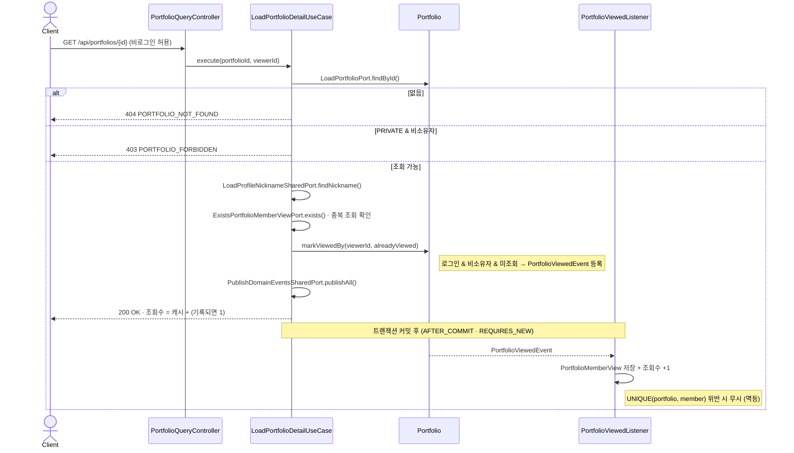
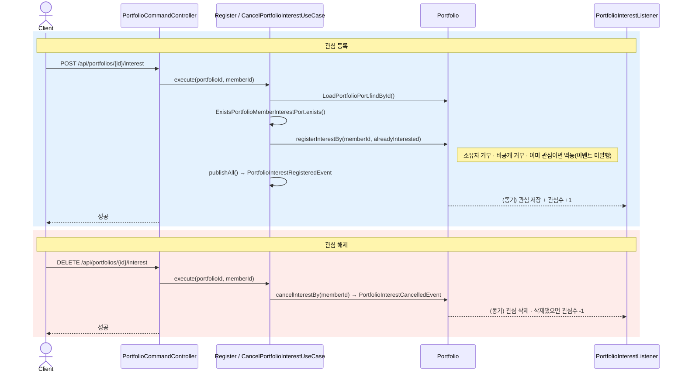
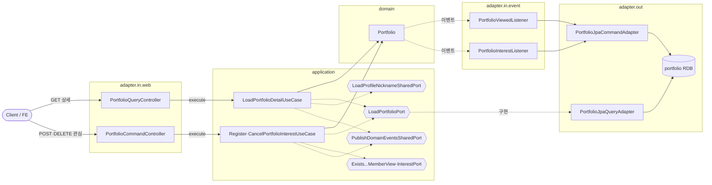

# 포트폴리오 조회·관심·조회수 흐름

포트폴리오 **등록 이후의 상호작용** — 상세 조회(조회수 집계), 관심 등록/해제 — 을 다룬다.
등록 사이클은 [register-flow.md](register-flow.md) 참고.

> 핵심: 조회수·관심수는 **캐시 값**(`cachedViewCount`·`cachedInterestCount`)으로 들고, 실제 기록(`PortfolioMemberView`·`PortfolioMemberInterest`)은 **도메인 이벤트**로 반영한다. 조회수와 관심의 이벤트 처리 시점이 다르다.

---

## 상세 조회 · 조회수

> 읽기 유스케이스가 조회수 이벤트를 등록하고, **커밋 후 별도 트랜잭션**에서 기록한다.

---

## 관심 등록 / 해제

> 쓰기 유스케이스라 리스너가 **같은 트랜잭션에서 동기**로 카운트를 갱신한다.

---

## 실패 분기

| 상황 | 응답 |
|---|---|
| 포트폴리오 없음 | 404 (`PORTFOLIO_NOT_FOUND` / `INTEREST_PORTFOLIO_NOT_FOUND`) |
| 비공개(PRIVATE) 조회·관심 (비소유자) | 403 (`…_FORBIDDEN`) |
| 소유자가 자기 글에 관심 | `INTEREST_OWNER_NOT_ALLOWED` |
| 이미 관심 / 미관심 반복 | 멱등 (오류 없음) |

> **이벤트 처리 시점 대비**
> - **조회수**: 읽기(`readOnly`) 유스케이스 → `AFTER_COMMIT` + `REQUIRES_NEW` (별도 쓰기 트랜잭션). 본인 조회는 도메인에서 제외.
> - **관심**: 쓰기 유스케이스 → `@EventListener` 동기(현재 트랜잭션). 등록은 `alreadyInterested`, 해제는 삭제행 수로 멱등 제어.

---

## 구조 · 헥사고날 계층

> 조회·관심 유스케이스의 계층 흐름. 의존은 `adapter.in → application(port) → domain`, `application(port) ← adapter.out`.
> 애그리거트·자식·불변식 등 **도메인 모델은 [domain-model.md](domain-model.md)** 로 분리했다.

- `{{...}}`(육각형) = 포트(interface). 조회수·관심수 갱신은 **이벤트 리스너**가 `adapter.out` 커맨드 어댑터로 수행한다.
- 도메인 애그리거트·자식 엔티티·불변식은 [domain-model.md](domain-model.md) 로 분리했다.
