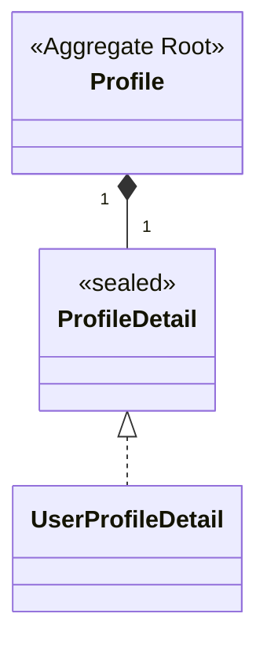

# profile 도메인 모델

회원 프로필(닉네임·공개코드·프로필 이미지)을 관리한다. `account` 의 `MemberAccountCreatedEvent` 를 받아 생성된다([../account/auth-flow.md](../account/auth-flow.md)).

## 구성 (클래스 다이어그램)

> 공통 `AuditingInfo` 는 생략한다.

## 애그리거트 · 불변식

| 애그리거트 | 역할 | 불변식 |
|---|---|---|
| `Profile` | 회원별 단일 프로필 | `createUserProfile()` 로 생성. `memberAccountId`·`publicCodeInfo`·`nickname`·`profileDetail` 필수 |
| `ProfileDetail` (sealed) | 프로필 상세. `UserProfileDetail` 이 유일 구현 | 향후 확장(예: 기업 프로필) 대비한 다형 구조 |

## 값 객체

| VO | 의미 |
|---|---|
| `PublicCodeInfo` | 8자 영숫자 공개코드. `generate()` 로 무작위 생성(중복검증은 상위 계층) |
| `ProfileImageInfo` | 원본·저장 이미지 이름/경로(기본 null) |
