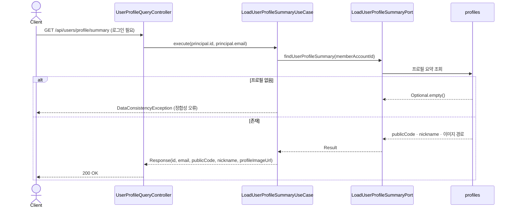
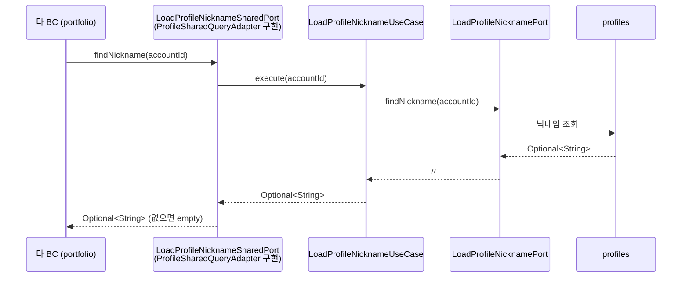
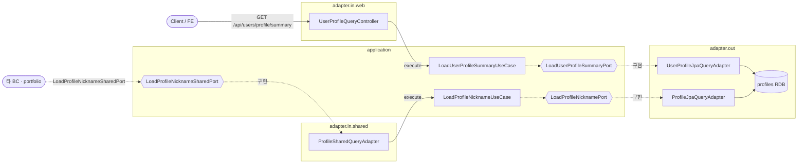

# 프로필 조회 흐름

`profile` 은 두 갈래로 조회된다 — 본인용 **프로필 요약(공개 API)** 과 타 BC 표시용 **닉네임(공용 포트)**.
도메인 구성은 [domain-model.md](domain-model.md) 참고.

> 핵심: 요약은 로그인 본인만 자기 프로필을 읽고(`id`·`email` 은 인증 principal, 나머지는 DB), 닉네임은 웹 엔드포인트 없이 **`LoadProfileNicknameSharedPort` 로만** 타 BC(포트폴리오)에 노출된다.

---

## 흐름 1 · 프로필 요약 조회 (공개 API · 본인)

로그인 사용자가 자기 프로필 요약을 읽는다. 인증된 `principal` 의 `id`·`email` 을 그대로 쓰고, `publicCode`·`nickname`·`프로필 이미지 경로` 만 DB 에서 채운다.

> `account` 가 회원을 만들 때 프로필도 함께 생성되므로([../account/auth-flow.md](../account/auth-flow.md)), 로그인 사용자에게 프로필이 없으면 정상 상황이 아니라 **정합성 오류**(`DataConsistencyException`)로 간주한다 — 404 가 아니다.

---

## 흐름 2 · 닉네임 조회 (공용 포트 · 타 BC)

`portfolio` 는 작성자 닉네임을 화면에 표시할 때, 같은 유스케이스를 **`adapter.in.shared` 경유 공용 포트**로 호출한다. 웹 컨트롤러는 없다.

> 유스케이스는 **`Optional` 을 그대로 반환**하고 없음 처리를 소비자에게 위임한다. 소비자별 정책이 다르다.

**소비자별 처리**

| 소비자 | 호출 위치 | 닉네임 없을 때 |
|---|---|---|
| 포트폴리오 상세 | `LoadPortfolioDetailUseCaseImpl` | `orElseThrow` → `PORTFOLIO_NICKNAME_NOT_FOUND` |
| 공개 포트폴리오 목록 | `PublicPortfolioSummariesAssembler` | `orElse(null)` (표시 생략) |

> 목록 조립은 항목마다 `findNickname` 을 호출한다 — 페이지 크기만큼 반복되는 **N+1** 지점.

---

## 실패 분기

| 상황 | 결과 |
|---|---|
| 요약: 로그인 본인에게 프로필 없음 | `DataConsistencyException` (정합성 오류) |
| 닉네임: 상세 조회에서 없음 | 404 `PORTFOLIO_NICKNAME_NOT_FOUND` (소비자 판단) |
| 닉네임: 목록 조립에서 없음 | 오류 없음 · `null` 로 표시 생략 |

---

## 구조 · 헥사고날 계층

> 요약은 `adapter.in.web` 로, 타 BC 닉네임은 `adapter.in.shared` 로 들어와 **각자의 유스케이스**를 쓴다. 포트(interface)는 육각형(`{{...}}`).

- `LoadProfileNicknameSharedPort` 는 `sharedkernel` 에 두고, `profile` 의 `ProfileSharedQueryAdapter` 가 구현해 BC 경계를 넘겨준다.
- 도메인 애그리거트(`Profile` · `ProfileDetail`)는 [domain-model.md](domain-model.md) 로 분리했다.
