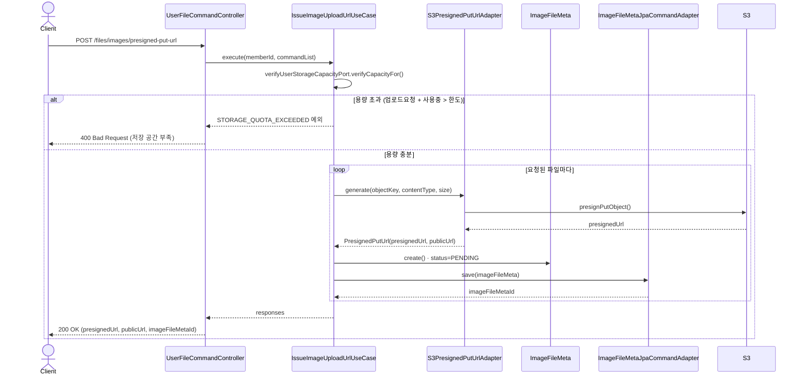
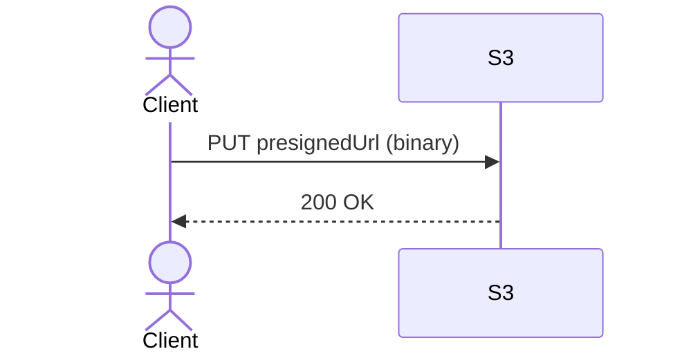
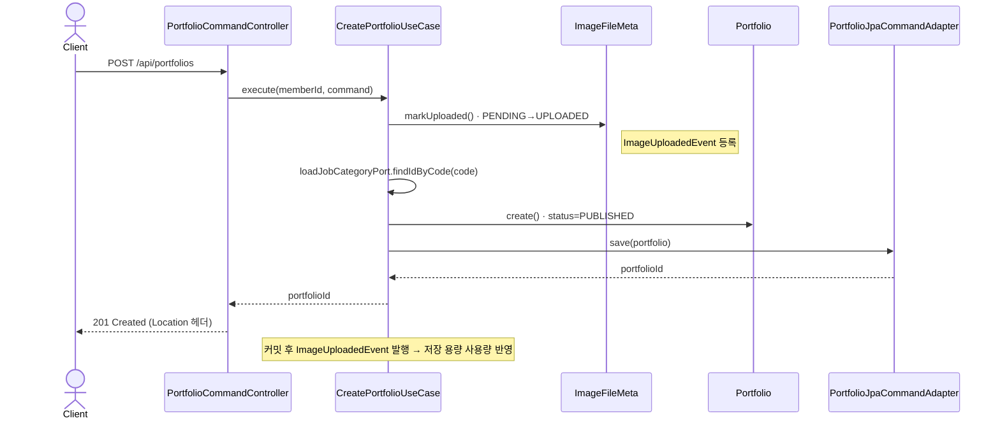

# 포트폴리오 등록 — 내부 시퀀스 (온보딩용)

> 독자: 신규 입사자 / 내부 구현을 이해해야 하는 개발자
> FE용 계약 플로우(인터랙션 고도)는 [../README.md](../README.md#5-계약-플로우-fe--backend) 참고.

`Presigned URL 발급 → S3 직접 업로드 → 포트폴리오 등록` 한 사이클을 내부 계층까지 보여줍니다.
`file` 모듈과 `portfolio` 모듈 두 BC에 걸쳐 있습니다.

## 1) Presigned URL 발급

## 2) S3 직접 업로드

서버를 거치지 않습니다. 이 시점에도 서버가 아는 상태는 여전히 `PENDING` 입니다.

## 3) 포트폴리오 등록

참조된 이미지를 `PENDING → UPLOADED` 로 확정한 뒤 포트폴리오를 저장합니다.

