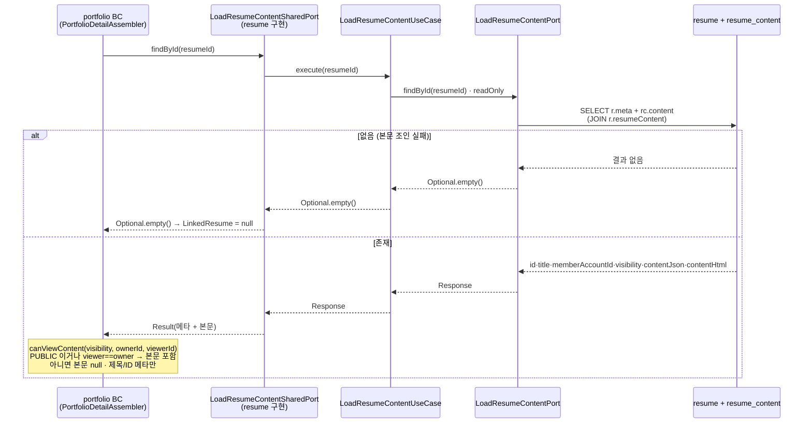
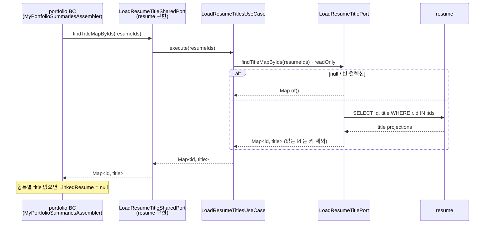
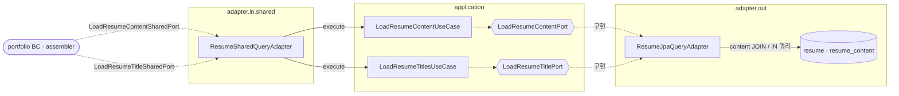

# 이력서 본문·제목 조회 흐름

`resume` 의 두 읽기 유스케이스 — **본문 단건 조회**(`LoadResumeContentUseCase`) 와 **제목 목록 조회**(`LoadResumeTitlesUseCase`) — 를 다룬다.
이력서 애그리거트 구조는 [domain-model.md](domain-model.md) 참고.

> 핵심: 이 두 조회는 **자체 REST 엔드포인트가 없다**. `adapter.in.shared` 의 `ResumeSharedQueryAdapter` 를 통해 sharedkernel 포트(`LoadResumeContentSharedPort`·`LoadResumeTitleSharedPort`)로만 노출되고, **소비자는 `portfolio` BC** 다. 가시성·소유자 판정은 resume 이 아니라 **소비자(portfolio)** 가 한다.

---

## 흐름 1 · 본문 단건 조회 (타 BC · 포트폴리오 상세)

`portfolio` 상세 응답이 연결된 이력서 섹션을 합성할 때, 이력서 **메타 + 본문**을 한 번에 받아 소비자 측에서 노출 여부를 결정한다.

> resume 유스케이스는 **가시성 판정을 하지 않는다**. `visibility` 와 `memberAccountId` 를 그대로 실어 보내고, 노출 정책(`canViewContent`)은 소비자인 `PortfolioDetailAssembler` 가 적용한다.

---

## 흐름 2 · 제목 목록 bulk 조회 (타 BC · 본인 포트폴리오 목록)

`portfolio` 목록 응답이 연결 이력서의 **제목만** 필요할 때, 여러 id 를 한 번에 조회한다.

---

## 실패 분기

| 상황 | 처리 |
|---|---|
| 본문 조회 · 이력서 없음/본문 미연결 | `Optional.empty()` → 소비자에서 `LinkedResume = null` (예외 없음) |
| 본문 조회 · 비공개(비소유자) | 조회는 성공, **소비자가** 본문을 null 로 마스킹하고 제목·ID 메타만 노출 |
| 제목 bulk · 빈/`null` 입력 | 빈 맵 반환 |
| 제목 bulk · 존재하지 않는 id 섞임 | 해당 id 만 결과 맵에서 제외 (부분 성공) |

> 두 흐름 모두 resume 측은 **404/403 을 던지지 않는다**. "없음/가려짐" 은 `Optional.empty` · 맵 키 부재로 표현되고, 사용자 노출 정책은 소비 BC 가 책임진다.

---

## 설계 포인트

- **엔드포인트 없는 순수 유스케이스**: 두 유스케이스는 `web` 컨트롤러 대신 `adapter.in.shared` 로만 진입한다. `ResumeSharedQueryAdapter` 가 sharedkernel 두 포트를 단일 구현으로 묶는다.
- **가시성 판정 위치**: resume 은 `visibility`·`memberAccountId` 를 실어 보내기만 하고(공용 DTO `Result`), 노출 결정은 소비자가 `viewer` 문맥과 함께 내린다 — 이력서 자체 뷰가 아닌 **연결 자원 합성**이라 뷰어 문맥이 소비자에 있기 때문.
- **bulk 최적화**: 목록 응답의 제목은 `IN :ids` 단일 쿼리(`findTitleMapByIds`)로 조회해 N+1 을 피한다.
- **본문 조회 폭 최소화**: 제목만 필요한 목록은 `LoadResumeTitleSharedPort`(제목 projection)로, 본문이 필요한 상세만 `LoadResumeContentSharedPort`(content JOIN)로 분리해 불필요한 본문 로딩을 막는다.

---

## 구조 · 헥사고날 계층

> 두 유스케이스는 `web` 진입점이 없고 `adapter.in.shared` 로만 들어온다. 소비자는 모두 `portfolio` BC 의 assembler 다.

- `{{...}}`(육각형) = 포트(interface). sharedkernel 의 두 out 포트는 `ResumeSharedQueryAdapter` 가 **단일 구현**으로 어댑트한다.
- 이력서 애그리거트·자식 엔티티·불변식은 [domain-model.md](domain-model.md) 로 분리했다.
