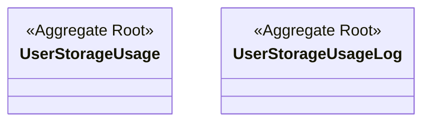

# storage 도메인 모델

회원의 스토리지 **사용량**과 그 **변경 이력**을 관리한다. 용량 산정·검증 흐름은 [storage-usage.md](storage-usage.md) 참고.

## 구성 (클래스 다이어그램)

> 공통 `AuditingInfo` 는 생략한다.

> 두 애그리거트는 **서로를 참조하지 않는 독립 루트**다 — 도메인 클래스 사이에 관계가 없다. "사용량 갱신 + 로그 기록"은 `Record`/`ReleaseImageStorageUsageUseCase`(application 레이어)가 조율한다.

## 애그리거트 · 불변식

| 애그리거트 | 역할 | 불변식 |
|---|---|---|
| `UserStorageUsage` | 회원별 현재 사용량 집계 | `usedQuotaBytes ≥ 0` (음수 금지, `decrease()` 시 부족하면 예외). `createForMember()`·`increase()`·`decrease()` |
| `UserStorageUsageLog` | 변경 이력(증감·사유·전후 잔액) | `idempotencyKey` UNIQUE → **멱등**. `createForResourceCreation()`·`createForResourceDeletion()` |

## 값 객체

| VO / enum | 값 |
|---|---|
| `ResourceKind` | `PORTFOLIO_CONTENT` · `PORTFOLIO_THUMBNAIL` · `RESUME_CONTENT` · `RESUME_ATTACHMENT` |
| `UsageChangeReason` | `RESOURCE_CREATION` · `RESOURCE_REPLACEMENT` · `RESOURCE_DELETION` |
