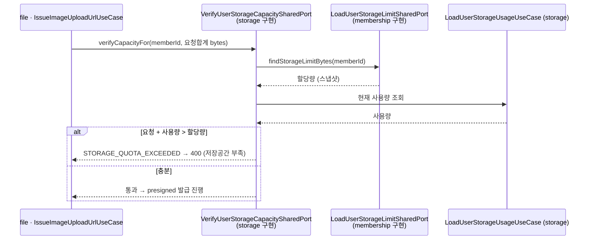
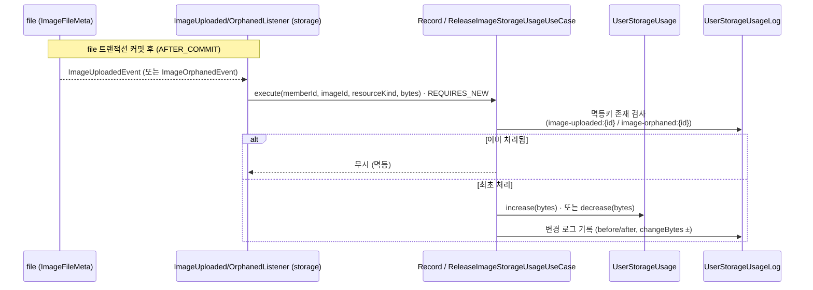
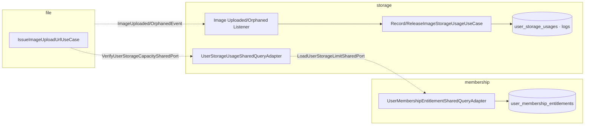

# 스토리지 용량 흐름 (할당량·사용량)

**할당량**은 `membership`, **사용량**은 `storage` 가 관리한다. 두 값을 합쳐 업로드 가능 여부를 판정하고, 실제 사용량은 `file` 의 이미지 이벤트로 증감한다.
이미지 자체의 상태 생애주기는 [../file/image-lifecycle.md](../file/image-lifecycle.md) 참고.

## 개념

| 개념 | 모듈 | 저장 | 의미 |
|---|---|---|---|
| **할당량(quota)** | membership | `UserMembershipEntitlement.storageQuotaBytesSnapshot` | 등급별 한도. **부여 시점 스냅샷**(정책이 바뀌어도 고정) |
| **사용량(usage)** | storage | `UserStorageUsage.usedQuotaBytes` (+ `UserStorageUsageLog`) | 현재 사용 바이트와 변경 이력 |

---

## 흐름 1 · 발급 전 용량 검증

`file` 이 presigned URL을 발급하기 전에, 요청 크기를 더해도 한도를 넘지 않는지 확인한다.

---

## 흐름 2 · 사용량 반영 (file 이벤트)

이미지가 확정/고아화되면 `file` 이 이벤트를 발행하고, `storage` 가 **커밋 이후** 사용량을 증감한다.

| 이벤트 | 유스케이스 | 사용량 | 로그 사유 |
|---|---|---|---|
| `ImageUploadedEvent` | `RecordImageStorageUsageUseCase` | **증가** | `RESOURCE_CREATION` |
| `ImageOrphanedEvent` | `ReleaseImageStorageUsageUseCase` | **감소** | `RESOURCE_DELETION` |

---

## 설계 포인트

- **스냅샷**: 할당량은 `UserMembershipEntitlement` 에 부여 시점 값으로 고정 → 정책 변경이 소급되지 않는다.
- **멱등**: `UserStorageUsageLog.idempotencyKey` 에 UNIQUE 제약. 이벤트 재시도/중복 시 `DataIntegrityViolationException` 을 잡아 무시한다.
- **독립 트랜잭션**: 리스너 유스케이스는 `REQUIRES_NEW` 로 `file` 트랜잭션과 분리된다(`AFTER_COMMIT` 이후 실행).
- **엔드포인트 없음**: 이 흐름의 유스케이스는 web 노출 없이 **공용 포트·이벤트로만** 구동된다.

---

## 구조 · 헥사고날 계층

